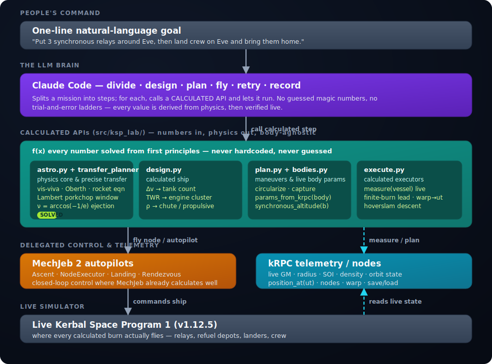

# ASTRA — an LLM-native Space Commander for Kerbal Space Program 1

> **One line of natural language in. A mission flown live in the game out.**
> The agent doesn't reinvent guidance, navigation, or control — it *delegates* to MechJeb2 and kRPC.

[](https://www.kerbalspaceprogram.com/)
[](https://www.python.org/)
[](https://krpc.github.io/krpc/)
[](https://github.com/MuMech/MechJeb2)
[](LICENSE)

ASTRA is an autonomous agent that flies Kerbal Space Program 1 **live**. You give it a goal in plain
English; **Claude Code** divides it into flight steps, researches how each step is normally done,
picks the right MechJeb or kRPC API for it, designs a minimal ship that can do the job, flies it
through MechJeb's autopilots **one autopilot at a time**, retries when a step fails, and writes down
every lesson it learns. The owner's framing for the whole thing: *a loop plus an experience notebook*,
behaving like **a Space Commander operating a spacecraft through an API**.

The guiding rule is **"don't reinvent the wheel."** MechJeb already solves ascent, rendezvous,
docking, and landing better than any controller an LLM would hand-roll under time pressure; kRPC
already gives exact telemetry and orbital math. ASTRA's job is to *orchestrate* those tools — split
the mission, choose the autopilot, set its parameters, start it, watch the result — not to compute
thrust vectors.

It has already flown a complete **Artemis-style Moon campaign** end to end, live in the game:
ascent → trans-Munar injection → Mun capture → lunar rendezvous & docking → crew transfer → Mun
landing → return and reentry. Public repo: **[github.com/shoal-rat/astra-ksp](https://github.com/shoal-rat/astra-ksp)**.

```text
$ PYTHONPATH=src python tools/astra.py "land a relay in high Mun orbit and bring a crew home"

[ASTRA] interpreted: body=Mun caps=['relay', 'hls_land_return', 'crew_return']
[ASTRA] capability relay: attempt 1/2 ... OK (relay_band_capture)
[ASTRA] capability hls_land_return: attempt 1/2 ... OK (ascend_to_orbit)
[ASTRA] capability crew_return: attempt 1/2 ... OK (recovered)
[ASTRA] RESULT: SUCCESS
```

---

## What it is, and why

- **LLM-native.** The agent is a loop with a memory, not a flight script. Claude Code is the brain:
  it reads the goal, plans the steps, selects the API for each, and decides what to do next from the
  live result.
- **Delegate, don't reimplement.** The heavy closed-loop control is handed to **MechJeb2**; the
  *knowing and measuring* (telemetry, reference frames, orbit prediction, maneuver-node planning) is
  handed to **kRPC**. ASTRA stitches them together.
- **A loop + an experience notebook.** Every attempt — what was tried, what failed, the fix — is
  recorded in [`docs/USING_KRPC_AND_MECHJEB.md`](docs/USING_KRPC_AND_MECHJEB.md) (the human notebook)
  and in an append-only run ledger, so the system gets smarter across flights.

**Claude Code is required.** It is the orchestrator that turns one sentence into a sequence of
correctly-chosen autopilot calls. Without it there is no task division, no API selection, no
diagnosis, no learning — just the tools it drives.

---

## Architecture

**Claude Code (task division + API selection) → Python tools → the C# bridge plugin → MechJeb2 + kRPC
→ live KSP 1.** The bridge wraps MechJeb's autopilots behind HTTP; kRPC supplies telemetry and orbital
math. The agent uses the bridge to *control* and kRPC to *measure*.



| Layer | What it is | Role |
| --- | --- | --- |
| **Claude Code** | the LLM orchestrator (required) | divide task · pick API · design ship · retry · record |
| **Python tools** | `tools/*.py` + `BridgeClient` / kRPC client | one driver per phase; start an autopilot, poll the result |
| **C# bridge** | `KspAutomationBridge`, HTTP `127.0.0.1:48500` | wraps MechJeb autopilots; spawns craft/crew; loads & launches |
| **kRPC** | RPC server `127.0.0.1:50000` (stream `50001`) | telemetry · reference frames · orbit prediction · node planning · warp · staging · set target |
| **MechJeb2** | `MechJeb2.dll` autopilots | Ascent · NodeExecutor · Rendezvous · Docking · Landing |
| **KSP 1.12.5** | the live game | where everything actually flies |

The bridge is compiled against the *installed* `MechJeb2.dll`, so a renamed MechJeb member is a
compile error rather than a silent runtime no-op — see
[`docs/USING_KRPC_AND_MECHJEB.md`](docs/USING_KRPC_AND_MECHJEB.md) §5.

---

## How the agent thinks

Given a task, Claude Code runs this loop, delegating the flying at every step:


1. **Divide the task.** Split the one-line goal into ordered flight steps — ascent, TMI, capture,
   rendezvous, dock, land, return.
2. **Research.** Work out how each step is normally done (KSP/MechJeb knowledge + the experience
   notebook).
3. **Pick the API.** Choose the right tool for that step — ascent → MechJeb ascent; phasing → MechJeb
   rendezvous; mate → MechJeb docking; touchdown → MechJeb landing; measurement and decisions → kRPC.
4. **Design the ship.** `src/ksp_lab/craft_writer.py` renders a minimal `.craft` that can do the step;
   the bridge loads and launches it.
5. **Fly the autopilot — one at a time.** Start the chosen autopilot, then **poll** kRPC / `/mj-status`
   for the outcome. **Warp wisely:** for a long boring coast, step rails-warp down (e.g. to ~80 km on a
   reentry) and then hand control back to MechJeb for the precise phase.
6. **Verify.** Check the result against the step's success predicate.
7. **Record the lesson.** Append what failed and the fix to the notebook / ledger. On failure,
   diagnose, **adjust one thing**, and retry within a bounded budget.

> **The hardest-won lesson: never hand-roll reentry or parachute timing.** Hand-rolled descent code
> killed six kerbals (a `warp_to(periapsis)` that hangs on a sub-atmosphere periapsis; chutes armed
> too low; a reentry loop that timed out above chute-arm). MechJeb's **Landing Autopilot** already
> *calculates* the deorbit, the deceleration ("recoil") burn timing, and the parachute deployment
> timing — hand it the whole descent and **monitor only**. (Full write-up in the notebook §7.)

---

## Tool catalogue

The main `tools/` drivers and the MechJeb / kRPC capability each one delegates to. Every driver is the
"pick an autopilot, start it, poll the result" pattern; none reimplement guidance.

| Tool | What it does | Delegates to |
| --- | --- | --- |
| `tools/astra.py` | **The agent.** One line of NL → mission plan → flies each capability, diagnoses, retries, records. | the whole loop below |
| `tools/mj_to_orbit.py` | Launch an Artemis vehicle and reach a parking orbit. | **MechJeb Ascent** (`/mj-ascent`, gravity turn + autostage + circularize); kRPC kicks the first stage off the pad |
| `tools/mj_to_mun.py` | LKO → low Mun orbit. | kRPC plans the TMI + capture nodes; **MechJeb NodeExecutor** (`/mj-execute-node`) flies the TMI; a kRPC retrograde burn does the SOI capture |
| `tools/fly_mj_dock.py` | Autonomous rendezvous + dock + crew transfer between two vessels. | **MechJeb Rendezvous** (`/mj-rendezvous`, main engine close) → **MechJeb Docking** (`/mj-dock`, RCS mate); kRPC sets target & measures distance; `/transfer-crew` moves a kerbal |
| `tools/mj_land_vessel.py` | Reentry + soft landing — deorbit through chutes. | **MechJeb Landing Autopilot** (`/mj-land`, calculates deorbit, decel burn, chute timing); kRPC warp-assists the high coast down to ~80 km only |
| `tools/fly_relay_once.py` | Milestone driver: relay comsat to a high Mun orbit. | the ascent → TMI → capture chain |
| `tools/fly_hls_predeploy.py` · `fly_hls_sortie.py` | Fly the HLS lander to Mun orbit; then descend, land, science, ascend. | ascent + transfer + the hoverslam landing |
| `tools/fly_orion.py` | Crew vehicle: launch → Mun orbit → return → reentry → recover. | ascent + return + **MechJeb landing** for the recovery |
| `tools/astra_daemon.py` | In-game UX: polls the bridge window for the player's typed command and streams status back. | the agent, driven from inside KSP |

`BridgeClient` (`src/ksp_lab/bridge_client.py`) is the Python wrapper for the bridge endpoints
(`mj_ascent`, `mj_execute_node`, `mj_rendezvous`, `mj_dock`, `mj_land`, `mj_status`, `mj_disable`,
`refuel_vessel`, `spawn_crew`, `transfer_crew`). kRPC is used directly for telemetry and node math.

---

## Achievements (flown live in KSP 1.12.5)

- **Full Artemis-style architecture, flown live.** Ascent → trans-Munar injection → Mun capture →
  lunar rendezvous & docking → crew transfer → Mun landing → return & reentry — each phase flown in
  the running game.
- **Autonomous rendezvous + docking + crew transfer** between two Orions: MechJeb's rendezvous AP
  closed ~1078 → 60 m and matched velocity, the docking AP did the port-aligned mate (part count
  21 → 42 as the vessels merged), and a kerbal transferred across. Driver: `tools/fly_mj_dock.py`.
- **Relay comsat** deployed to a high Mun orbit (~2041 × 101 km).
- **HLS lander** flew to Mun orbit, performed a soft powered landing (touchdown ~ −0.1 m/s) via a
  Falcon-9-style **hoverslam** (suicide burn), ran surface science, and ascended back to lunar orbit.
- **Orion crew vehicle** launched to Mun orbit, returned to Kerbin, survived reentry behind a heat
  shield, and recovered under parachute (~ −1.4 m/s) — landing flown by MechJeb's Landing Autopilot.
- **ASTRA** — the one-line-natural-language agent (`tools/astra.py`) that orchestrates all of the
  above behind a single command, with diagnosis and retry.

---

## Setup

**Requirements**

- **KSP 1.12.5** open, with the **kRPC** mod server listening on `127.0.0.1:50000` (stream `50001`).
- **MechJeb2** installed, plus the `MechJebForAll.cfg` ModuleManager patch so every command pod
  carries a `MechJebCore` (generated craft have no MechJeb part otherwise). See notebook §4.
- The project's C# **`KspAutomationBridge`** plugin serving on `http://127.0.0.1:48500`
  (build with `scripts/build_bridge.ps1 -KspRoot "<KSP>"`, install the DLL, reload KSP).
- **Python 3.13** and the [`krpc`](https://pypi.org/project/krpc/) package.
- Paths come from `configs/local-ksp.yaml`.

**Run the agent (zero config — no API key needed):**

```bash
PYTHONPATH=src python tools/astra.py "land a relay in high Mun orbit and bring a crew home"
```

That uses the built-in heuristic interpreter, so it runs with no credentials. To let Claude do the
natural-language interpretation, set `ANTHROPIC_API_KEY` (and optionally `ASTRA_MODEL`, default
`claude-opus-4-8`).

**Useful flags:** `--dry-run` (plan only, don't fly) · `--max-attempts N` (retries per phase, default
`2`) · `--no-llm` (force the heuristic interpreter) · `--config PATH`.

**Run a single phase directly:**

```bash
PYTHONPATH=src python tools/mj_to_orbit.py  configs/local-ksp.yaml hls 90
PYTHONPATH=src python tools/mj_to_mun.py    configs/local-ksp.yaml AI-HLS-Artemis
PYTHONPATH=src python tools/fly_mj_dock.py  configs/local-ksp.yaml <CHASER> <TARGET>
PYTHONPATH=src python tools/mj_land_vessel.py configs/local-ksp.yaml Orion
```

**Play it in-game:** run `PYTHONPATH=src python tools/astra_daemon.py configs/local-ksp.yaml`; it polls
the bridge's in-game window for a typed mission and streams live status back to the panel — no
alt-tabbing out of the game.

---

## Project layout

```text
ksp1-automation-lab/
├── tools/                         # one driver per phase + the agent CLI
│   ├── astra.py                   # the agent — "one sentence in"
│   ├── astra_daemon.py            # in-game command/status loop
│   ├── mj_to_orbit.py             # MechJeb ascent to parking orbit
│   ├── mj_to_mun.py               # TMI (MechJeb node executor) + kRPC capture
│   ├── fly_mj_dock.py             # MechJeb rendezvous + docking + crew transfer
│   ├── mj_land_vessel.py          # MechJeb Landing Autopilot reentry + touchdown
│   └── fly_relay_once.py / fly_hls_*.py / fly_orion.py   # milestone drivers
├── src/ksp_lab/
│   ├── astra/                     # interpreter · ledger · knowledge · agent (the loop)
│   ├── bridge_client.py           # Python wrapper for the bridge HTTP endpoints
│   ├── flight_controller.py       # live kRPC flight helpers (frames, nodes, capture)
│   ├── craft_writer.py            # renders .craft files for each phase
│   ├── guidance.py                # Δv / TWR / hoverslam math
│   └── artemis.py, parts.py, models.py, runner.py, telemetry.py …
├── csharp/KspAutomationBridge/    # the C# plugin: /mj-* autopilot wrappers + craft/crew
├── configs/                       # local-ksp.yaml and friends
├── docs/                          # USING_KRPC_AND_MECHJEB.md (the notebook) + diagrams
└── tests/
```

---

## The experience notebook

[`docs/USING_KRPC_AND_MECHJEB.md`](docs/USING_KRPC_AND_MECHJEB.md) is the most important file for any
LLM continuing this work. It records the hard-won lessons from flying a full Mun mission with MechJeb:
the reference-frame rule that cost ~13 docking attempts, why rendezvous (main engine) must come before
docking (RCS), why the node executor needs a kRPC warp-assist, why a basic probe core can't hold SAS
retrograde, and why reentry/parachute timing must be delegated to MechJeb. The principle throughout:
**use the API, calculate when you must fly by hand, and write down what you learn.**

---

## Acknowledgements

- [**Kerbal Space Program**](https://www.kerbalspaceprogram.com/) — the simulator everything flies in.
- [**MechJeb2**](https://github.com/MuMech/MechJeb2) — the production-grade autopilots ASTRA delegates the flying to.
- [**kRPC**](https://krpc.github.io/krpc/) — the remote-procedure-call mod for live telemetry and control.
- [**Anthropic Claude**](https://www.anthropic.com/) — the orchestrating brain (and optional NL interpretation).

---

*Licensed under the [MIT License](LICENSE).*
