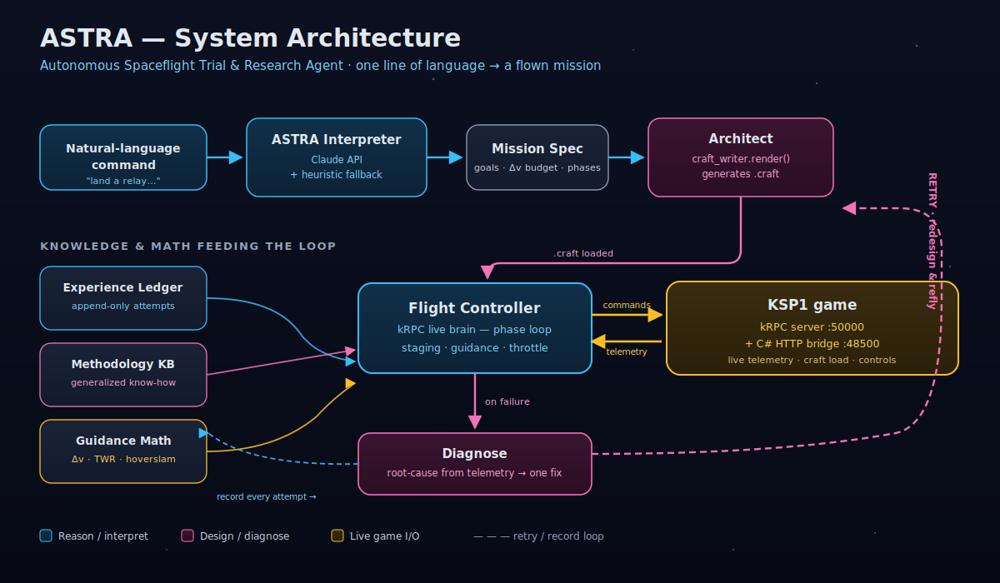
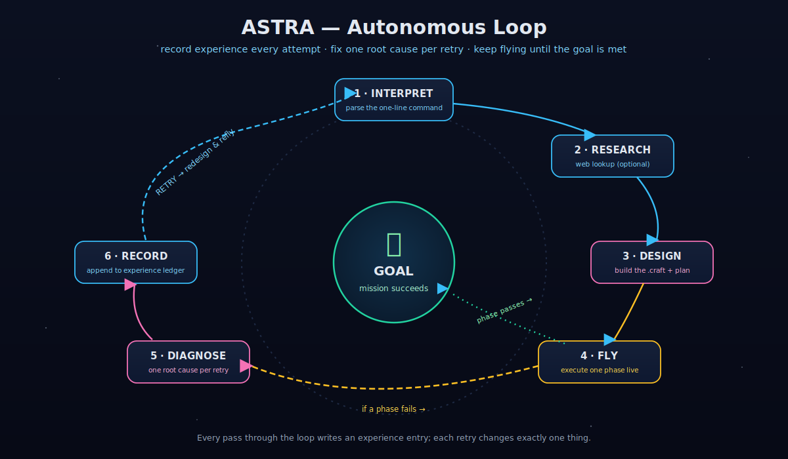
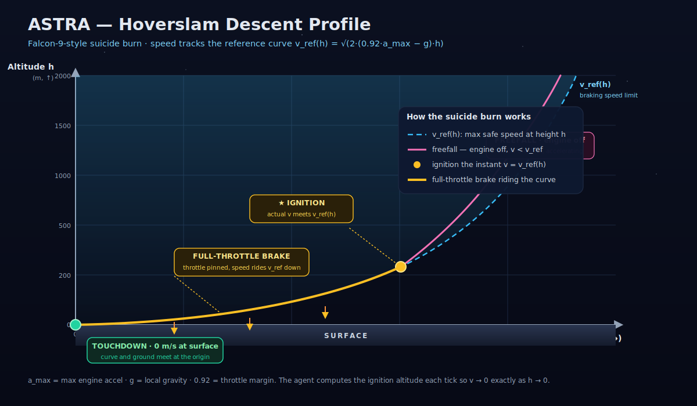
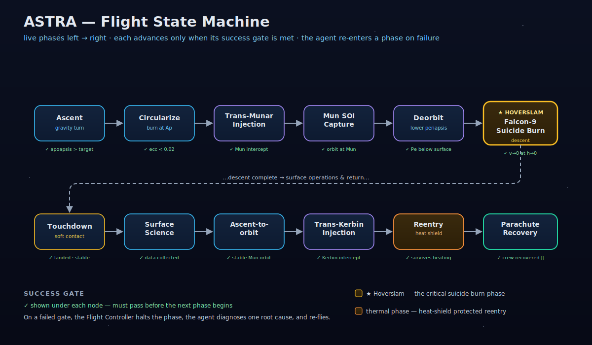

# ASTRA — Autonomous Spaceflight Trial & Research Agent

> **One sentence in. A flown mission out.**

[](https://www.kerbalspaceprogram.com/)
[](https://www.python.org/)
[](https://krpc.github.io/krpc/)
[](#project-layout)
[](LICENSE)

You type **one line of natural language**. ASTRA interprets it, designs the rocket, writes the
`.craft` file, flies it **live** in Kerbal Space Program 1 over kRPC, watches the telemetry, diagnoses
what went wrong against a growing experience ledger, fixes itself, and retries until the mission
succeeds. It has already flown a complete Artemis-style Moon campaign end to end — relay, lander, and
crew vehicle — in the real game.



```text
$ PYTHONPATH=src python tools/astra.py "land a relay in high Mun orbit and bring a crew home"

[ASTRA] interpreted (heuristic): body=Mun caps=['relay', 'hls_land_return', 'crew_return']
[ASTRA] capability relay: attempt 1/2 ... OK (relay_band_capture)
[ASTRA] capability hls_land_return: attempt 1/2 ... OK (ascend_to_orbit)
[ASTRA] capability crew_return: attempt 1/2 ... OK (recovered)
[ASTRA] RESULT: SUCCESS
```

---

## Quickstart

**Requirements**

- **KSP1** open, with the **kRPC** mod server listening on `127.0.0.1:50000` (stream port `50001`).
- The project's C# **`KspAutomationBridge`** plugin serving on `http://127.0.0.1:48500`.
- **Python 3.13** and the [`krpc`](https://pypi.org/project/krpc/) package.
- The game's default save folder (paths come from `configs/local-ksp.yaml`).

**Run it (zero config — no API key needed):**

```bash
PYTHONPATH=src python tools/astra.py "land a relay in high Mun orbit and bring a crew home"
```

That uses the built-in **heuristic interpreter**, so it works with no credentials at all.

**Let Claude do the interpretation (optional):**

```bash
export ANTHROPIC_API_KEY=sk-...        # enables LLM natural-language interpretation
export ASTRA_MODEL=claude-opus-4-8     # optional; this is the default model
PYTHONPATH=src python tools/astra.py "put a comsat in a high Mun orbit, then fly a crew there and back"
```

**Useful flags**

| Flag | Effect |
| --- | --- |
| `--dry-run` | Interpret the command and print the plan; do **not** fly. |
| `--max-attempts N` | Retries per phase to absorb run-to-run variance (default `2`). |
| `--no-llm` | Force the heuristic interpreter even if `ANTHROPIC_API_KEY` is set. |
| `--config PATH` | kRPC / runner config (default `configs/local-ksp.yaml`). |

---

## What it does

ASTRA orchestrates a set of **proven, separately-validated flight drivers** — the flight core that
actually flew the campaign — and wraps them in an autonomous interpret → fly → diagnose → retry loop.
Three milestones have been flown **live in the game** and are verified:

| # | Milestone | Result (live in KSP1) |
| --- | --- | --- |
| 1 | **Relay comsat** | Deployed to a high Mun orbit of **2041 × 101 km**. |
| 2 | **HLS lander** | Flew to Mun orbit, performed a **soft powered landing** on the Mun (touchdown **−0.1 m/s**), ran surface science, and **ascended back to lunar orbit**. |
| 3 | **Orion crew vehicle** | Launched to Mun orbit (rendezvous-equivalent with the parked lander), **returned to Kerbin**, survived **reentry** behind a heat shield, and **recovered under parachute at −1.4 m/s**. |

Each milestone has a standalone driver that ASTRA invokes, so you can also fly any one of them on its
own (see [Project layout](#project-layout)).

---

## How the agent thinks

ASTRA is an agent, not a script: a natural-language front door, a persistent memory of every attempt,
automatic diagnosis of a failed flight, and bounded retry to ride out the stochastic parts of a live
simulation.



**1 · Interpret.** `interpreter.py` turns plain English into a `MissionPlan` (target body +
ordered capabilities). With `ANTHROPIC_API_KEY` set, Claude does the interpretation; otherwise a
keyword **heuristic fallback** handles it. Either way the agent runs.

**2 · Research.** `knowledge.py` assembles context from the methodology knowledge base and the
experience ledger before planning — the same hard-won rules a human would consult.

**3 · Design & fly.** The plan's capabilities map to validated drivers (`relay`,
`hls_land_return`, `crew_return`). The flight controller designs and renders the craft, then flies it
live over kRPC.

**4 · Diagnose.** When a flight ends on a failure **marker**, `KnowledgeBase.diagnose()` matches it
against the ledger's seeded **failure → fix rules** and returns a principle + a concrete fix with a
confidence label (`known` vs `unknown`). An `unknown` failure stops the loop instead of burning
retries blindly — the honest move when there's nothing learned to act on.

**5 · Record.** Every attempt — success or failure, with its marker, the fix applied, and a log
tail — is appended to an **append-only experience ledger** (`runs/astra_experience.jsonl`, mirrored to
`runs/ASTRA_LEDGER.md`). This is what lets ASTRA get smarter across runs.

### The experience ledger

`ledger.py` ships with a baseline of **hard-won failure → fix rules** distilled from the project's
real flights (roughly 16 relay attempts plus the HLS and Orion arcs). Each is a `match` pattern paired
with a principle and a fix. A few representative entries:

| Principle | Fix (abridged) |
| --- | --- |
| **Launch TWR margin** | Actual launch TWR < 1 because the estimate ignores accessory mass — lighten upper stages or add thrust until estimated launch TWR ≳ 1.4. |
| **Attitude authority** *(master root cause)* | Heavy upper stacks need dedicated inline reaction-wheel torque before any finite burn; hold energy-removal burns on the engine gimbal, re-pointed every tick. |
| **Falcon-9 hoverslam landing** | Maximize freefall, then full-throttle brake on surface-retrograde tracking the reference curve to null all velocity at the ground. |
| **Return craft need a heat shield** | An uncrewed return craft still needs a heat shield + parachute for Kerbin reentry. |

Live attempts append to this ledger, so any fix that turns a failure into a later success is available
to future runs as a learned rule.

---

## The Falcon-9 hoverslam landing

The Mun touchdown uses a **suicide burn** (a.k.a. "hoverslam"): keep the engine **off** to maximize
freefall, then fire a **single full-throttle burn** on surface-retrograde that nulls all velocity
*exactly* at the ground. It's pre-computed, fuel-optimal, and time-optimal — no hovering, no waste.

The craft coasts until its speed meets a reference curve, then brakes along it:

$$v_\text{ref}(h) = \sqrt{2 \,(0.92\,a_\text{max} - g)\, h}$$

This is the largest speed from which a burn at 92% of full thrust can still stop the craft by
touchdown. Because `v_ref → 0` as `h → 0`, riding the curve down brings the vessel to ~0 m/s right at
the surface. The reserved top 8% of thrust is headroom in case ignition is a hair late.



The hoverslam is the highlighted critical node in the live flight state machine — every phase has an
explicit success gate before the next one is allowed to begin:



The math lives in `src/ksp_lab/guidance.py` (`hoverslam_reference_speed_mps`, `hoverslam_throttle`,
plus vis-viva / Hohmann / capture-burn helpers) and is exercised by `tests/test_guidance.py`.

---

## Architecture

```text
"land a relay in high Mun orbit and bring a crew home"
        │
        ▼
 ┌──────────────┐   Mission Spec   ┌───────────────┐   render()   ┌──────────────────┐
 │ Interpreter  │ ───────────────▶ │   Architect   │ ───────────▶ │  Flight          │
 │ (Claude /    │  body + ordered  │ craft_writer  │   .craft     │  Controller      │
 │  heuristic)  │  capabilities    │               │              │  (live, kRPC)    │
 └──────────────┘                  └───────────────┘              └────────┬─────────┘
        ▲                                                                  │ kRPC + C# bridge
        │ diagnose & retry                                                 ▼
 ┌──────┴────────┐   ┌────────────────────┐   ┌──────────────┐      ┌─────────────┐
 │ Experience    │   │ Methodology KB     │   │ Guidance     │      │   KSP1      │
 │ Ledger        │   │ (failure→fix rules)│   │ math         │      │ (the game)  │
 └───────────────┘   └────────────────────┘   └──────────────┘      └─────────────┘
```

- **Interpreter** parses the command into a mission spec.
- **Architect** (`craft_writer.render()`) generates the `.craft` file for each phase.
- **Flight Controller** flies it live in KSP1 via kRPC and the C# `KspAutomationBridge` plugin.
- **Experience Ledger**, **Methodology KB**, and **Guidance math** feed the diagnose-and-retry loop.

The full vector diagram is at the top of this README (`docs/diagrams/architecture.svg`).

---

## Project layout

```text
ksp1-automation-lab/
├── tools/
│   ├── astra.py                 # the agent CLI — "one sentence in"
│   ├── fly_relay_once.py        # Milestone 1 driver — relay to high Mun orbit
│   ├── fly_hls_predeploy.py     # Milestone 2a — fly the HLS lander to Mun orbit
│   ├── fly_hls_sortie.py        # Milestone 2b — descend, land, science, ascend
│   └── fly_orion.py             # Milestone 3 — crew vehicle launch → return → recover
├── src/ksp_lab/
│   ├── astra/
│   │   ├── interpreter.py       # NL → MissionPlan (Claude API + heuristic fallback)
│   │   ├── ledger.py            # append-only experience memory + seeded failure→fix rules
│   │   ├── knowledge.py         # methodology KB + the diagnoser
│   │   └── agent.py             # the autonomous interpret→fly→diagnose→retry loop
│   ├── flight_controller.py     # ~3,500-line live kRPC flight brain (ascent, transfer,
│   │                            #   capture, hoverslam landing, return)
│   ├── craft_writer.py          # generates .craft files via render()
│   ├── guidance.py              # Δv / TWR / hoverslam math
│   ├── artemis.py, parts.py, models.py, runner.py
├── csharp/KspAutomationBridge/  # C# KSP plugin (state, craft load, launch, revert, reset)
├── configs/                     # local-ksp.yaml and friends
├── docs/diagrams/               # the SVGs embedded above
└── tests/                       # 53 passing tests
```

`KnowledgeBase` also looks for a transferable **`GENERALIZED_AEROSPACE_METHODOLOGY.md`** — the
human-readable methodology that is ASTRA's knowledge base — and folds it into the planning context
when present.

**Per-phase drivers** are the proven flight core ASTRA orchestrates. Run any of them directly:

```bash
PYTHONPATH=src python tools/fly_relay_once.py   configs/local-ksp.yaml
PYTHONPATH=src python tools/fly_hls_predeploy.py configs/local-ksp.yaml
PYTHONPATH=src python tools/fly_hls_sortie.py    configs/local-ksp.yaml
PYTHONPATH=src python tools/fly_orion.py         configs/local-ksp.yaml
```

---

## Roadmap

- **Automated docking & crew transfer — implemented, live-tuning in progress.** Docking-capable craft
  (Clamp-O-Tron port + RV-105 RCS + monopropellant), a rendezvous/proximity/dock/undock control
  routine (`run_dock_and_transfer`), and a driver (`tools/fly_dock.py`) all exist; once two ports
  mate, KSP merges the vessels, which *is* the crew transfer. Like every capability here, robust
  autonomous rendezvous needs live tuning across flights.
- **Visual fidelity.** Docking craft already drop the nose cone for a flush port; further nose-cone
  fairings and real mod craft would make generated vehicles *look* like a Saturn V / Starship.
- **More target bodies.** Generalize the guidance and mission planner beyond the Mun.

---

## Honest limitations

This project values ruthless honesty over polish. The real state of things:

- **Crew transfer was originally *modeled*.** "Crew at the lander" meant both vehicles in Mun orbit
  plus a separately recovered capsule — the rendezvous geometry was achieved, not a literal docked
  hand-off. Automated docking (ports + RCS + a rendezvous/dock control routine + `tools/fly_dock.py`)
  is now **implemented in code and the craft are docking-equipped**, but end-to-end autonomous
  rendezvous-and-dock is **best-effort and still being tuned across live flights** — exactly the
  multi-flight maturation curve every other capability here went through.
- **"Mission complete" was a chain of four separately-driven phases.** ASTRA now orchestrates those
  drivers behind one command, but the phases were validated independently. Run-to-run variance —
  especially the trans-Munar injection — is **absorbed by retries, not eliminated.**
- **Visual realism is functional, not pixel-perfect.** Generated craft prioritize flyability over
  looking like their real-world inspirations. No fairings or detailed mod parts yet.
- **The design Δv / TWR estimator ignores small accessory masses.** A craft's own quoted figures are
  therefore slight **upper bounds**. This is mitigated by a TWR safety margin (and is itself one of the
  seeded ledger rules), but it's a known approximation, not exact bookkeeping.

---

## Acknowledgements

- [**Kerbal Space Program**](https://www.kerbalspaceprogram.com/) — the simulator everything flies in.
- [**kRPC**](https://krpc.github.io/krpc/) — the remote-procedure-call mod that makes live control possible.
- [**Anthropic Claude**](https://www.anthropic.com/) — optional natural-language interpretation of the mission command.

---

*Licensed under the [MIT License](LICENSE).*
