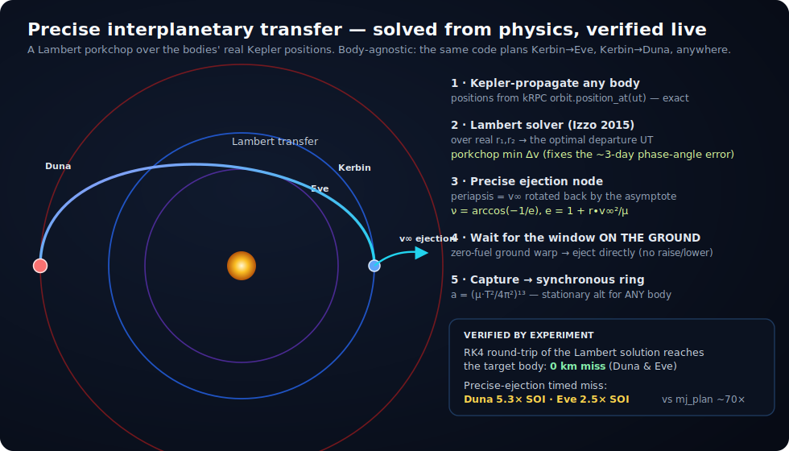

# ASTRA — an LLM-native Space Commander for Kerbal Space Program 1

> **One line of natural language in. A mission flown live in the game out.**
> The brain divides the mission, **calculates** the ship and every maneuver from physics, and flies it —
> delegating closed-loop control to MechJeb2 where MechJeb already calculates well. Every number is
> derived, never guessed.

[](https://www.kerbalspaceprogram.com/)
[](https://www.python.org/)
[](https://krpc.github.io/krpc/)
[](https://github.com/MuMech/MechJeb2)
[](LICENSE)

ASTRA is an autonomous agent that flies Kerbal Space Program 1 **live**. You give it a goal in plain
English; **Claude Code** is the brain. It divides the goal into flight steps, **designs a ship whose
every part count is calculated from physics**, **plans each maneuver from the live orbital state**,
flies it, retries when a step fails, and records what it learns. Public repo:
**[github.com/shoal-rat/astra-ksp](https://github.com/shoal-rat/astra-ksp)**.

```text
People's command  ->  Claude Code (the LLM brain)  ->  CALCULATED APIs  ->  MechJeb2 / kRPC  ->  live KSP ships
```

The guiding rule is **"every number is calculated, never guessed."** Tank counts come from the rocket
equation; engine clusters from the TWR the body demands; the interplanetary ejection from the Oberth
effect over a vis-viva Hohmann; parachute counts from terminal velocity in the target body's *live*
atmospheric density; the powered touchdown from the hoverslam reference curve. When a step has no API,
the brain **generates a calculated one** rather than reaching for a magic number.

It has already flown a complete **Artemis-style Moon campaign** end to end, live in the game — ascent →
trans-Munar injection → Mun capture → lunar rendezvous & docking → crew transfer → Mun landing → return
and reentry — and the calculated layer now extends the same discipline to **Duna ("Mars")**.

```text
$ PYTHONPATH=src python tools/astra.py "land a relay in high Mun orbit and bring a crew home"

[ASTRA] interpreted: body=Mun caps=['relay', 'hls_land_return', 'crew_return']
[ASTRA] capability relay: attempt 1/2 ... OK (relay_band_capture)
[ASTRA] capability hls_land_return: attempt 1/2 ... OK (ascend_to_orbit)
[ASTRA] capability crew_return: attempt 1/2 ... OK (recovered)
[ASTRA] RESULT: SUCCESS
```

---

## The idea

- **LLM-native.** The agent is a loop with a memory, not a flight script. Claude Code reads the goal,
  divides it into steps, picks (or generates) the calculated API for each, and decides what to do next
  from the live result.
- **Calculate, then delegate.** Every quantity — Δv, TWR, tank/engine/chute counts, burn lead, warp
  target, descent throttle — is computed from first principles in `src/ksp_lab/astro.py`. The
  *measuring* (telemetry, reference frames, orbit prediction) is handed to **kRPC**; the *closed-loop
  flying that MechJeb already does well* (ascent, node execution, the powered touchdown) is handed to
  **MechJeb2**. ASTRA computes the numbers and stitches the two together.
- **A loop + an experience notebook.** Every attempt — what was tried, what failed, the fix — is
  recorded in [`docs/USING_KRPC_AND_MECHJEB.md`](docs/USING_KRPC_AND_MECHJEB.md) and an append-only run
  ledger, so the system gets smarter across flights.

**Claude Code is required.** It is the orchestrator that turns one sentence into a sequence of
calculated maneuvers and a calculated ship. Without it there is no task division, no API selection or
generation, no diagnosis, no learning — just the tools it drives.

---

## Architecture

**People's command → Claude Code (the LLM brain) → the calculated-API layer → MechJeb2 + kRPC → live
KSP 1.** The brain divides any mission, designs a ship from requirements, plans each maneuver from the
live state, and flies it; kRPC supplies the live body/orbit constants every calculation needs, and
MechJeb handles the closed-loop phases it already calculates well.


| Layer | What it is | Role |
| --- | --- | --- |
| **Claude Code** | the LLM brain (required) | divide mission · design ship · plan maneuver · fly · retry · record · *generate a calculated API when one is missing* |
| **Calculated APIs** | `src/ksp_lab/{astro,design,plan,execute}.py` | physics core + ship designer + planners + executors — every number derived |
| **C# bridge** | `KspAutomationBridge`, HTTP `127.0.0.1:48500` | wraps MechJeb autopilots; spawns craft/crew; refuels; loads & launches |
| **kRPC** | RPC server `127.0.0.1:50000` (stream `50001`) | live GM · radius · surface gravity · atmospheric density · orbit state · nodes · warp |
| **MechJeb2** | `MechJeb2.dll` autopilots | Ascent · NodeExecutor · Landing — the closed-loop phases it already calculates well |
| **KSP 1.12.5** | the live game | where everything actually flies |

No body constants are hardcoded anywhere in the calculated layer. `execute.measure(vessel)` reads
`gravitational_parameter`, `equatorial_radius`, `surface_gravity`, `density_at(...)`, and the live
orbit from kRPC and passes them into the planners and the designer, so the **same code is correct for
Kerbin, Duna, or any modded body**.

---

## The calculated-API layer

This is what replaced the old "delegate everything, calculate only when forced" framing. Four modules,
each one numbers-in / numbers-out, all closed-form.

### `astro.py` — the physics core

The closed-form aerospace math, with no guessed thresholds and no magic-number ladders:

- **Orbital mechanics (the vis-viva family):** `circular_speed`, `vis_viva_speed`, `orbital_period`,
  `hohmann`, `oberth_ejection_dv`, `interplanetary_departure`, `capture_dv`, `deorbit_dv`, and
  `phase_angle_for_transfer` for launch windows.
- **Rocket equation & stage sizing:** `rocket_dv`, `propellant_mass_for_dv` (inverts Δv → propellant),
  and `twr`.
- **Atmospheric descent:** `terminal_velocity`, `parachutes_for_touchdown` (rounds *up* — a fractional
  chute does not exist), and the suicide-burn / hoverslam law: `suicide_burn_altitude`,
  `hoverslam_reference_speed`, `hoverslam_throttle`, plus `burn_time_s` and `finite_burn_lead_s` for
  centring a finite burn on a node.

**Worked number:** for a low-Kerbin parking orbit the heliocentric Hohmann to Duna sets the hyperbolic
excess speed, and `oberth_ejection_dv` turns it into the ejection burn — **≈ 1060 m/s**, validated
live. Nothing in that chain is a guess.

### `design.py` — requirements-driven, physics-calculated ship design

First enumerate what the mission *needs* (`ShipRequirements`: crew, payload, heat shield, docking, an
ordered list of propulsive `Phase`s in fire order, and an optional `LandingSite`), then **calculate
every part count**:

- **Tanks** by the closed-form rocket equation — `_tank_count_for_dv` inverts
  `R = exp(Δv/v_e) = m₀/m₁`, carrying the full wet mass of the stages above. Stages are sized
  top-down (last-firing first) so each lower stage carries the cascade above it.
- **A diameter that makes it look like a real rocket.** Each stage picks the **narrowest** standard
  diameter (1.25 / 2.5 / 3.75 m) that holds its propellant within a per-stage fineness budget (no skinny
  noodle) and is **≥ every stage above it** — a monotonic non-increasing taper, base widest, with
  conical adapters at each step. No more 22:1 needles.
- **Engine clusters that fit.** `_size_one` grows `engine_count` until thrust meets `min_twr`, but caps
  the cluster at how many engine **bells** physically fit a 1.5× mounting plate (`max_cluster_in_tank`,
  Saturn-V / Falcon-9 octaweb) — engines never hang off the side of the tank.
- **The payload is housed.** A probe rides inside a procedural-fairing ogive shroud; a crew capsule is
  its own nose. Landing legs sit at the **landing stage's** base, not floating mid-stack.
- **Parachutes** by terminal velocity in the target body's **live** atmospheric density —
  `parachute_count` calls `astro.parachutes_for_touchdown`, returning **0 for a propulsive lander**.

`design_ship` returns a `RocketDesign` with an `estimates` block and a traceable `design_log`. Before
anything flies, `tools/design_chart.py` renders a **three-view** and hard-gates the proportions
(`looks_like_a_rocket`: L/D 4–19, monotonic taper, housed payload, engine at the base, flyable), and
`tools/render_chart_png.py` rasterizes that chart to **PNG via headless Chrome** so clipping or floating
parts are caught by the eye — the gate is necessary but not sufficient, so you *look*.

### `plan.py` — calculated planners (live state in, a maneuver out)

Thin closed-form wrappers over `astro.py` that turn the current orbit into an exact maneuver dict
(`dv`, node components, and timing): `circularize_at_apoapsis`, `deorbit`, `capture`,
`interplanetary_transfer` (the Oberth ejection plus the v∞, transfer time, and phase-angle window),
`landing_burn` (the hoverslam ignition altitude, reference speed, and throttle), `node_burn_time`, and
the parking-orbit / ascent-inclination targets to hand MechJeb's ascent AP.

### `execute.py` — calculated executors (measure → plan → fly)

Each executor **measures** the live state with kRPC, asks `plan.py` for the exact maneuver, and flies
it:

- `measure(vessel)` — the single source of truth; reads all body/orbit constants live.
- `execute_node` — flies a maneuver node with a finite burn whose **lead is the burn's own half-time**
  (computed, not guessed), tapers throttle proportionally as Δv → 0, and refuels ElectricCharge during
  the burn.
- `warp_to_ut` — chunked rails-warp to a **computed** universal time (a single stepped warp overshoots).
- `circularize`, `deorbit_into_atmosphere` — measure, plan, place a kRPC node, execute it.
- `propulsive_landing` — the Starship descent with **no parachutes**: coast in real time (never warping
  below ~2× the atmosphere top, because warping below it applies reentry heating instantly and once
  destroyed two crews) until the live speed reaches `hoverslam_reference_speed`, then hold throttle on
  the curve to a ~0 m/s touchdown.

### `transfer_planner.py` — the precise interplanetary math (Lambert porkchop)



The phase-angle launch-window estimate is **~1–3 days off** — it assumes circular, coplanar orbits and a
tangential burn. `transfer_planner.py` replaces it with the real thing. It **Kepler-propagates each body's
position from kRPC** (`orbit.position_at(ut)`, exact) and solves **Lambert's problem** (Izzo 2015, ported
from `lamberthub`) over a porkchop grid to find the *exact* optimal departure UT for **any body pair** —
Kerbin→Eve, Kerbin→Duna, anywhere. From the resulting hyperbolic-excess vector **v∞** it places the ejection
node precisely: the burn periapsis is **v∞ rotated back by the asymptote true anomaly `ν = arccos(−1/e)`**,
at the next parking-orbit alignment (the two-clock fix that ties the heliocentric window to the in-orbit
ejection time).

**Verified by experiment, not asserted:**

- **RK4-propagating the Lambert solution reaches the target body's position with `0 km` miss** (Duna and Eve).
- The precise ejection's position-sampled timed miss is **`5.3× SOI` (Duna), `2.5× SOI` (Eve)** — versus
  ~70× for MechJeb's planner — so the mid-course correction closes it to a clean encounter, or needs none.
- The synchronous-ring altitude is `a = (μ·T²/4π²)^⅓ − R` for *any* body — Kerbin keostationary **2863 km**,
  Duna **2880 km**, Eve **10 328 km** — returning "no synchronous orbit" when it would fall outside the SOI
  (the Mun). `bodies.params_from_krpc(body)` reads `μ / radius / SOI / atmosphere / sidereal period` live, so
  the same transfer/capture/ring code is correct for every body with **no hard-coded mission logic**.

Every step is **measured and derived**, then checked against a propagated ground truth before it is trusted.

### `tools/astra.py` — the brain CLI

One line of natural language → `AstraAgent` divides it into capabilities, plans and flies each,
diagnoses failures, retries within a bounded budget, and records the run. Runs with **zero
configuration** (a built-in heuristic interpreter, no API key); set `ANTHROPIC_API_KEY` to let Claude
do the natural-language interpretation (`ASTRA_MODEL` selects the model, default `claude-opus-4-8`).

---

## How the agent thinks


1. **Divide the mission** into ordered flight steps — ascent, ejection/TMI, capture, rendezvous, dock,
   land, return.
2. **Design the ship from requirements.** Enumerate crew / heat shield / docking / the propulsive
   phases / the landing site, then **calculate** every tank, engine cluster, and chute (`design.py`).
   `craft_writer.py` renders the `.craft` with the calculated engine clusters and chute count; the
   bridge launches it.
3. **Plan each maneuver from the live state** (`plan.py` over `astro.py`) — the Δv, node vector, and
   timing, computed from what kRPC measures right now.
4. **Fly it** (`execute.py`), delegating the closed-loop phases MechJeb already calculates well (ascent,
   node execution, the powered touchdown) and computing the glue around them — the finite-burn lead, the
   warp target, the hoverslam throttle.
5. **Verify** against the step's success predicate.
6. **Record the lesson**, diagnose on failure, adjust one thing, and retry.

> **The crew-death lesson, reframed as a calculation.** Terminal velocity scales as `1/√ρ`, so Duna's
> thin air (ρ far below Kerbin's) makes a parachute that is safe at Kerbin lethal at Duna: a single Mk16
> on a crew pod settles at a hull-crushing terminal speed there. The old code guessed one chute and lost
> a crew. The designer now **computes** the count from the target body's live density — roughly ten Mk16
> chutes for a crewed Duna pod — **or returns zero** and the ship lands propulsively on the hoverslam
> curve. The number is no longer a guess; it's `parachutes_for_touchdown`. (Full write-up in the
> notebook §7.)

---

## The Mars (Duna) and Venus (Eve) goals

KSP1's analogues are **Duna** (Mars) and **Eve** (Venus). Both run on the *same* body-agnostic transfer
pipeline — one window calculation deploys to any target body.

**Duna — a propulsive, no-parachute, Starship-class crewed lander-and-return:**

- **Interplanetary transfer** — the precise **Lambert porkchop** window + the `ν = arccos(−1/e)` asymptote
  ejection (`transfer_planner.py`), waited out **on the ground for zero fuel**, then a mid-course correction
  and capture above the atmosphere.
- **Propulsive landing on Duna** — `execute.propulsive_landing` on the hoverslam law (zero parachutes), then
  **propulsive ascent and return** to Kerbin.

**Eve — 3 synchronous relays, then a crewed landing and return:**

- **3 relays at the Eve-stationary altitude (10 328 km)**, 120° phased, captured cheaply by **aerocapture**
  in Eve's thick (5 atm) atmosphere.
- **Crewed landing**, designed *backwards from the ascent*: land high on a mountain to cut the climb,
  parachute down, then the **~6500 m/s Eve ascent vehicle** (aerospike asparagus, sized from the rocket
  equation in Eve's *live* gravity and density) back to orbit and home, aerobraking free at Kerbin. Eve's
  ascent is the single hardest stock challenge.

The general `transfer_to_body` driver (`tools/deploy_relay_transfer.py`) waits for the window on the ground,
ejects precisely, corrects, captures, and circularises to the body's synchronous ring.

---

## Setup

**Requirements**

- **KSP 1.12.5** open, with the **kRPC** mod server listening on `127.0.0.1:50000` (stream `50001`).
- **MechJeb2** installed, plus the `MechJebForAll.cfg` ModuleManager patch so every command pod carries
  a `MechJebCore` (generated craft have no MechJeb part otherwise). See notebook §4.
- The project's C# **`KspAutomationBridge`** plugin serving on `http://127.0.0.1:48500`
  (build with `scripts/build_bridge.ps1 -KspRoot "<KSP>"`, install the DLL, reload KSP).
- **Python 3.13** and the [`krpc`](https://pypi.org/project/krpc/) package.
- Paths come from `configs/local-ksp.yaml`.

**Run the agent (zero config — no API key needed):**

```bash
PYTHONPATH=src python tools/astra.py "land a relay in high Mun orbit and bring a crew home"
```

Set `ANTHROPIC_API_KEY` to let Claude do the natural-language interpretation. **Useful flags:**
`--dry-run` (plan only, don't fly) · `--max-attempts N` (retries per phase, default `2`) · `--no-llm`
(force the heuristic interpreter) · `--config PATH`.

**Run a single phase directly:**

```bash
PYTHONPATH=src python tools/mj_to_orbit.py  configs/local-ksp.yaml hls 90
PYTHONPATH=src python tools/mj_to_mun.py    configs/local-ksp.yaml AI-HLS-Artemis
PYTHONPATH=src python tools/mj_to_duna.py   configs/local-ksp.yaml <vessel-name>
PYTHONPATH=src python tools/mj_land_vessel.py configs/local-ksp.yaml Orion
```

**Play it in-game:** run `PYTHONPATH=src python tools/astra_daemon.py configs/local-ksp.yaml`; it polls
the bridge's in-game window for a typed mission and streams live status back to the panel — no
alt-tabbing out of the game.

---

## Project layout

```text
ksp1-automation-lab/
├── tools/                         # the brain CLI + one driver per phase
│   ├── astra.py                   # the brain — "one sentence in"
│   ├── astra_daemon.py            # in-game command/status loop
│   ├── mj_to_orbit.py             # MechJeb ascent to parking orbit
│   ├── mj_to_mun.py               # TMI (MechJeb node executor) + kRPC capture
│   ├── mj_to_duna.py / mj_duna_capture.py / mj_land_duna.py   # the Duna ("Mars") chain
│   ├── mj_land_vessel.py          # MechJeb Landing Autopilot reentry + touchdown
│   ├── design_chart.py            # three-view chart + looks_like_a_rocket geometry gate + live verify
│   ├── render_chart_png.py        # rasterize a chart SVG -> PNG (headless Chrome) to inspect by eye
│   ├── validate_against_game.py   # cross-check the math vs kRPC + MechJeb (proves it matches the game)
│   └── fly_relay_once.py / fly_hls_*.py / fly_orion.py        # milestone drivers
├── src/ksp_lab/
│   ├── astro.py                   # CALCULATED physics core (vis-viva, Oberth, rocket eqn, hoverslam)
│   ├── transfer_planner.py        # PRECISE interplanetary: Lambert porkchop window + asymptote ejection (any body)
│   ├── bodies.py                  # live body params (params_from_krpc) + synchronous-altitude (any body)
│   ├── design.py                  # requirements-driven, physics-calculated ship designer
│   ├── plan.py                    # calculated planners (live state -> maneuver)
│   ├── execute.py                 # calculated executors (measure -> plan -> fly)
│   ├── astra/                     # interpreter · ledger · knowledge · agent (the loop)
│   ├── bridge_client.py           # Python wrapper for the bridge HTTP endpoints
│   ├── craft_writer.py            # renders .craft files (engine clusters + calculated chute count)
│   ├── parts.py, models.py        # part catalog (chute drag area, engine_count) + data models
│   └── flight_controller.py, guidance.py, telemetry.py …
├── csharp/KspAutomationBridge/    # the C# plugin: /mj-* autopilot wrappers + craft/crew
├── configs/                       # local-ksp.yaml and friends
├── docs/                          # architecture.svg · transfer-math.svg · mission-flow.svg · the notebook
└── tests/
```

---

## Achievements (flown live in KSP 1.12.5)

- **Full Artemis-style architecture, flown live.** Ascent → trans-Munar injection → Mun capture →
  lunar rendezvous & docking → crew transfer → Mun landing → return & reentry — each phase in the
  running game.
- **Autonomous rendezvous + docking + crew transfer** between two Orions (closed ~1078 → 60 m, port-
  aligned mate, a kerbal across).
- **Relay comsat** to a high Mun orbit (~2041 × 101 km).
- **HLS lander** flew to Mun orbit, performed a powered landing (touchdown ~ −0.1 m/s) on the
  hoverslam curve, ran surface science, and ascended back to lunar orbit.
- **Orion crew vehicle** launched to Mun orbit, returned to Kerbin, and recovered behind a heat shield.
- **A live constellation**, deployed by the agent: working relays around **Kerbin** (keostationary), the
  **Mun**, and **Duna** — the first Duna relay captured and circularised in-game.
- **The precise interplanetary math, solved and experimentally verified.** A Lambert porkchop window with a
  **`0 km` RK4 round-trip** to Duna *and* Eve, and the `ν = arccos(−1/e)` asymptote ejection at a
  **`5.3× SOI` (Duna) / `2.5× SOI` (Eve)** timed miss — versus ~70× for MechJeb's planner. Body-agnostic and
  ready for **Eve (Venus)**.
- **Every number proven against the live game.** `tools/validate_against_game.py` cross-checks the math
  versus kRPC and MechJeb: apoapsis / periapsis / SMA / eccentricity / period match the stock conic to
  **0 m**, vis-viva to `3e-6 m/s`, and the rocket-equation **burn duration matches MechJeb's
  FuelFlowSimulation to `~1e-6 s`** across every stage — the agent's `t = m₀v_e/F·(1−e^{−Δv/v_e})` *is*
  MechJeb's method. Maneuver timing follows MechJeb's half-burn-before-the-node convention.
- **Rockets that actually look like rockets.** The diameter-laddered designer + three-view geometry gate,
  verified by rendering each chart to PNG: a housed payload, a monotonic taper through real adapters, an
  engine cluster on the base plate (never hung off the side), and legs at the lander base — relay `L/D 7.2`,
  Mars vehicle `L/D 9.1`, single-launch Duna round-trip `L/D 18.4`, all feasible.

---

## The experience notebook

[`docs/USING_KRPC_AND_MECHJEB.md`](docs/USING_KRPC_AND_MECHJEB.md) is the most important file for any
LLM continuing this work. It records the hard-won lessons from flying a full Mun mission: the
reference-frame rule that cost ~13 docking attempts, why rendezvous must come before docking, why the
node executor needs a kRPC warp-assist, and why reentry below the atmosphere must never be warped. The
principle throughout: **calculate every number, delegate the closed-loop flying MechJeb already does
well, and write down what you learn.**

---

## Acknowledgements

- [**Kerbal Space Program**](https://www.kerbalspaceprogram.com/) — the simulator everything flies in.
- [**MechJeb2**](https://github.com/MuMech/MechJeb2) — the production-grade autopilots ASTRA delegates the closed-loop flying to.
- [**kRPC**](https://krpc.github.io/krpc/) — the remote-procedure-call mod for live telemetry and the body/orbit constants every calculation reads.
- [**Anthropic Claude**](https://www.anthropic.com/) — the orchestrating brain (and optional NL interpretation).

---

*Licensed under the [MIT License](LICENSE).*
