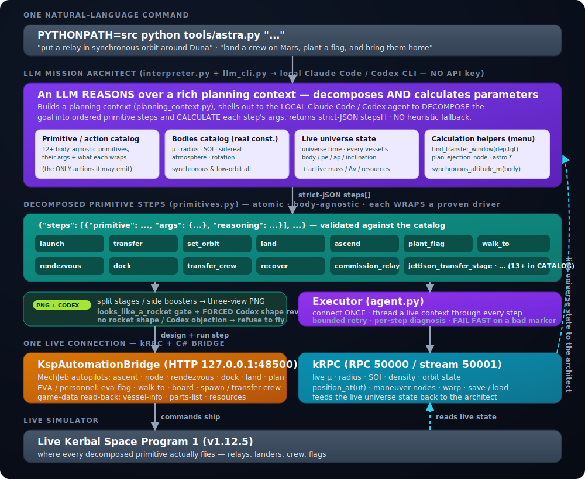
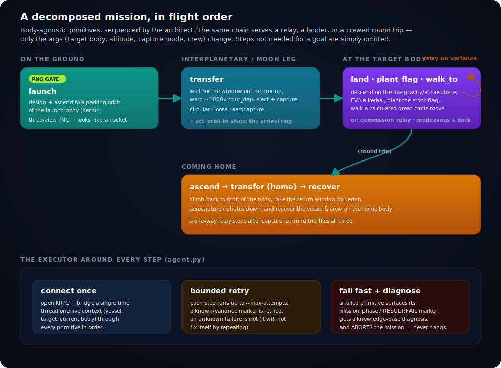

# ASTRA — an LLM mission architect for Kerbal Space Program 1

> **One line of natural language in. A mission decomposed, calculated, and flown live in the game out.**
> Claude does not pick from a menu of canned missions — it reads the goal, breaks it into atomic flight
> primitives, and reasons out every parameter (launch window, altitude, capture mode, return) from real
> body constants and a menu of calculation helpers.

[](https://www.kerbalspaceprogram.com/)
[](https://www.python.org/)
[](https://krpc.github.io/krpc/)
[](https://github.com/MuMech/MechJeb2)
[](LICENSE)

ASTRA is a **general** agent that flies Kerbal Space Program 1 **live**. You give it a goal in plain
English; **Claude** is the mission architect. It decomposes the goal into an ordered list of atomic,
body-agnostic primitives, reasons out the parameters for each from physics, flies them over a single
live connection, retries when a step fails, and records what it learns. Public repo:
**[github.com/shoal-rat/astra-ksp](https://github.com/shoal-rat/astra-ksp)**.

```text
NL command  ->  LLM architect (catalog + bodies + live state + calc helpers)  ->  primitive steps  ->  executor over kRPC + bridge  ->  live KSP
```

This is the redesign. ASTRA used to map a command to one of three coarse, Mun-hardcoded bundles and run
a bespoke driver per bundle. Now the interpreter forces a real **task decomposition**: any body in the
catalog, any sequence the goal needs — a synchronous relay around Duna, a crew flag on Gilly with a
return, a multi-leg tour. The agent reads the destination from the text, not from a default.

```text
$ PYTHONPATH=src python tools/astra.py "put a relay in synchronous orbit around Duna" --dry-run

[ASTRA] decompose: [llm] Duna: launch(crew=0) -> transfer(target_body=Duna, capture_mode=circular,
                   capture_alt_km=2880) -> commission_relay()
        rationale: Duna sync alt = 2880 km from synchronous_altitude_m; circular capture holds the ring.
  [OK ] 1. launch(...): dry_run (attempts 0)
  [OK ] 2. transfer(...): dry_run (attempts 0)
  [OK ] 3. commission_relay(): dry_run (attempts 0)
  RESULT: SUCCESS
```

(With `--no-llm` the heuristic decomposer reaches the same shape from keywords:
`launch(radial_boosters=4) -> transfer(target_body=Duna, capture_mode=circular) -> commission_relay`.)

---

## How it works

The pipeline is four stages: **interpret → plan → decompose → execute.** A natural-language command
becomes a planning context, the context goes to Claude, Claude returns an ordered list of primitive
steps with calculated args, and the executor runs them over one live kRPC + bridge connection.



| Stage | Code | What it does |
| --- | --- | --- |
| **NL command** | `tools/astra.py` | one line of plain English describes the whole mission |
| **LLM architect** | `astra/interpreter.py`, `astra/planning_context.py` | builds a rich planning context and asks Claude to decompose AND calculate; strict-JSON out, heuristic fallback |
| **Primitive steps** | `astra/primitives.py` | 12+ atomic, body-agnostic primitives, each wrapping a proven flight driver |
| **Executor** | `astra/agent.py` | connects once, threads a live context through every step, bounded retry, fail fast |
| **C# bridge** | `csharp/KspAutomationBridge`, HTTP `127.0.0.1:48500` | MechJeb autopilots · EVA / personnel · game-data read-back |
| **kRPC** | RPC `127.0.0.1:50000` (stream `50001`) | live μ · radius · SOI · density · orbit state · nodes · warp |
| **KSP 1.12.5** | the live game | where everything actually flies |

Nothing in the planning layer hardcodes a body. The bodies catalog carries the real stock-KSP constants
(μ, radius, SOI, sidereal period, atmosphere, rotation, synchronous + low-orbit altitude) for every body
except the Sun, and the live universe state is read from kRPC at plan time, so **the same agent plans
correctly for Kerbin, the Mun, Duna, Eve, or any body in the catalog.**

---

## 1 · The LLM mission architect

The interpreter (`astra/interpreter.py`) is the core of the redesign. It treats Claude as a **flight
director with real orbital-mechanics comprehension**, not a phrase-matcher. When `ANTHROPIC_API_KEY` is
set it builds a planning context (`astra/planning_context.py`), hands it to Claude (the real Anthropic
Messages API; `ASTRA_MODEL` selects the model, default `claude-opus-4-8`), and asks it to do three
things in flight-director order:

1. **Decompose** the goal into an ordered list of atomic primitive steps from the catalog. Flight order
   matters — launch → interplanetary transfer → on-body actions → transfer home → recover — and there is
   deliberate **leeway for novel multi-leg missions**: a Moho loop near the Sun via an Eve gravity assist,
   a grand tour of several bodies, a constellation of relays, a refuel-depot pattern. The architect
   invents the sequence; it is not forced into a canned template.
2. **Calculate** each step's parameters from the body constants and the calculation helpers, not from
   guesswork — the target body and altitude (`synchronous`/`stationary` → that body's
   `synchronous_alt_km`, `low orbit` → `low_orbit_alt_km`), the capture mode (`circular` for a precise
   ring, `aerocapture` for a cheap arrival at a body with air, `loose` for a bound ellipse), the launch
   window (for any Sun-to-Sun transfer it must call `transfer_planner.find_transfer_window` to get the
   departure UT, then wait on the ground and time-warp ~1000× to it), and the launch profile (crew,
   heat shield, chutes, radial boosters for a heavy upper).
3. **Annotate** each step with the short calculation it used, so the run report shows the reasoning.

It replies with a strict JSON object — `{"target_body": ..., "steps": [{"primitive", "args", "reasoning"}],
"mission_rationale": ..., "open_questions": [...]}` — which is parsed and **validated against the catalog**:
unknown or hallucinated primitives are dropped, free-text calculation notes are lifted out of the
executable args (the live primitives take no `notes` kwarg), and any arg that is not a real parameter of
that primitive is repaired away.

If there is no API key, or the network/parse fails, a **deterministic, body-agnostic heuristic
decomposer** takes over: it parses the target body from any catalogue name in the text (longest-first, so
`Mun` isn't shadowed by `Minmus`) plus the crew/flag/relay/land/return keywords, and emits a sensible
primitive sequence — no `body="Mun"` default anywhere. Run it with `--no-llm` to force this path.

### The planning context

`astra/planning_context.py` is the briefing a real flight planner would want. It is assembled fresh per
command and rendered to a token-efficient text block:

- **The primitive / action catalog** — every primitive's name, description, param schema, and the proven
  driver it wraps. The only actions the architect may emit.
- **The bodies catalog** — real stock-KSP constants for every body (μ, radius, surface g, SOI, sidereal
  period, rotation, atmosphere top + surface density), with `synchronous_alt_km` and `low_orbit_alt_km`
  derived so the plan doesn't have to (it returns `outside_SOI` where a synchronous ring would fall past
  the SOI, e.g. the Mun, so the plan falls back to a sub-synchronous ring).
- **The live universe state** — universe time and every existing vessel's body / periapsis / apoapsis /
  inclination, plus (over the live bridge) the active vessel's real mass / Δv / resources, so the plan
  reasons over the **same numbers the game uses** for phasing, rendezvous targets, and ground-wait windows.
- **The calculation-helper menu** — the helpers a step may reference: `transfer_planner.find_transfer_window`
  for launch/transfer windows, `plan_ejection_node` for the ejection burn, the `astro.*` closed-form Δv
  family, and `bodies.synchronous_altitude_m` for stationary altitudes.

There are two builders: a **live** one (with a kRPC handle, adds universe + vessels) and an **offline**
one (catalog + bodies + helpers only) used for `--dry-run` and the test suite. Both degrade gracefully —
a dead bridge falls back to the orbit-only universe and never raises.

---

## 2 · The primitive catalog

`astra/primitives.py` is a registry of small, atomic, **body-agnostic** steps. Each does exactly one
thing for *any* body, reading the launch/target body from its args + `bodies.py` + live kRPC, never a
hardcoded `body="Mun"`. The design rule is **wrap, don't rewrite**: every primitive calls a *proven*
flight function — the validated path — and only parameterizes and sequences it. Each logs a
`mission_phase: <name>` and a `RESULT: SUCCESS|FAIL` marker and returns a structured `PrimitiveResult`.

| Primitive | What it does | Wraps |
| --- | --- | --- |
| `launch` | design + ascend a craft to a parking orbit of the launch body | `deploy_relay.launch_to_lko` |
| `transfer` | transfer + capture at another body (`circular` / `loose` / `aerocapture`) | `deploy_relay_transfer.transfer_to_body` / `transfer_to_mun`, `crewed_eve_roundtrip.capture_at_eve_loose` |
| `set_orbit` | Hohmann / circularize to a target orbit of the current body | `deploy_relay_transfer._hohmann_to_radius` |
| `land` | land on the current body (live gravity / atmosphere), optional lat/lon | `bridge.mj_land` + `eve_flag_mission._descend_to_gilly_surface` |
| `ascend` | climb from the surface back to orbit of the current body | `flight_controller._launch_from_mun` |
| `plant_flag` | EVA a kerbal, plant the stock flag, board back (verifies landed + re-boarded) | `bridge.eva_flag` + `eva_board` + `eva_status` |
| `walk_to` | walk an EVA kerbal a calculated great-circle move to a lat/lon | `eva_control.walk_kerbal_to` |
| `rendezvous` | rendezvous the active vessel with a named target | `bridge.mj_rendezvous` |
| `dock` | dock to a named target's port | `bridge.mj_dock` |
| `transfer_crew` | move a kerbal between docked vessels | `bridge.transfer_crew` |
| `recover` | descend (chutes / aerocapture) + recover the vessel & crew on the home body | `crewed_eve_roundtrip.descend_and_recover` |
| `commission_relay` | deploy antenna + solar, set the vessel type to Relay | `deploy_relay.commission` |
| `select_vessel` | make a parked vessel active by name, tolerant of KSP's localized name suffixes | `vessel_match.vessel_names_match` |

The executor runs the decomposed steps over the one live connection, in order, and **fails fast**: a
failed primitive surfaces its marker, gets a knowledge-base diagnosis, and aborts the mission rather than
hanging silently.



---

## 3 · The PNG three-view design constraint

A launch is **never** flown without a PNG-verified rocket shape. The `launch` primitive hard-gates on
`tools/design_chart.py`'s `design_and_verify`, which:

1. sizes the rocket from the same `ShipRequirements` the proven ascent will fly;
2. renders its **three-view** orthographic chart (side / front / top) to SVG;
3. **rasterizes that SVG to a real PNG** via `tools/render_chart_png.py` (headless Chrome / Edge), so
   the shape is proven as an inspectable *image*, not trusted from XML coordinates; and
4. runs the `looks_like_a_rocket` geometry gate (sane fineness ratio, monotonic taper, housed payload,
   engine at the base, flyable, symmetric strap-on boosters accepted).

The render is the proof; the gate is the pass/fail. A design is only `ok=True` when the geometry gate
passes **and** the PNG actually rendered. If the shape fails — or the renderer is unavailable — the
primitive logs `design_rejected` / `RESULT: FAIL` and **refuses to fly**. You can see the gate verdict
either way, but you never launch a craft that isn't a rocket.

---

## 4 · Full game-data integration

The lab knows the real stock parts. `src/ksp_lab/parts.py` keeps a small hand-validated curated core
(masses, heights, Isp checked one-by-one against the live game) and **materializes the whole stock parts
tree** on top of it: `materialize_catalog()` walks the real KSP GameData `.cfg` folders once, as an
offline build step, and writes every rocket-relevant `PART{}` node into a committed
`src/ksp_lab/data/stock_parts.json` — **423 stock parts** (every liquid engine, SRB, tank, decoupler,
adapter, nose cone, fairing, pod, RCS, reaction wheel, heat shield, chute, leg, science part). At import
the JSON loads so the catalog is available without the game installed; where a materialized part shares a
curated part's identity, the **curated value wins** so the validated numbers are never overwritten. The
design sizer then queries the full roster ("every 2.5 m engine, sorted by thrust") instead of a five-engine
pool.

---

## 5 · The C# bridge

`csharp/KspAutomationBridge` is a KSP plugin serving HTTP on `127.0.0.1:48500`. It is built with the
in-box .NET Framework C# compiler directly — `bash csharp/build.sh` runs `csc` (no msbuild / Roslyn) and
writes the DLL. It exposes three groups of endpoints:

- **MechJeb autopilots** — `/mj-ascent`, `/mj-execute-node`, `/mj-rendezvous`, `/mj-dock`, `/mj-land`,
  `/mj-plan`, plus `/mj-status` and `/mj-stage-stats`. The closed-loop flying MechJeb already does well.
- **EVA / personnel** — `/eva-flag` (plants the stock flag headlessly via `KerbalEVA.PlantFlag`),
  `/eva-go`, `/eva-board`, `/eva-walk-to`, `/eva-status`, `/spawn-crew`, `/transfer-crew`, `/crew-list`,
  `/crew-roster`. This is what makes the autonomous flag plant and the EVA walk possible.
- **Game-data read-back** — `/vessel-info`, `/parts-list`, `/resources`, so the architect reasons over
  the game's own numbers (real mass, Δv, parts, resources), not a guess.

The EVA layer is **calculated, not guessed**: `src/ksp_lab/eva_control.py` expresses every surface move
as a great-circle bearing + distance on the body sphere (the exact haversine the C# bridge mirrors), and
delegates the pathing to the stock waypoint engine — so the number the planner computes equals the number
the bridge reports back.

---

## Proven results (flown live in KSP 1.12.5)

Stated honestly — what is flown, and what is built but not yet validated end to end.

**Flown and verified:**

- **3 synchronous Eve relays deployed** at the Eve-stationary altitude (~10 328 km), each launched on a
  4-booster asparagus stack, transferred on the precise Lambert window, and circularised onto the
  synchronous ring (e ≈ 0.000–0.001). This is the body-agnostic transfer pipeline doing the whole chain
  for a real target.
- **The crewed launch, solved.** Getting the first kerbal to Eve orbit alive took a long debugging arc —
  a headless pod, an asparagus liftoff that wouldn't ignite the strap-on engines, and finally a staging
  bug where ascent fired the *payload* decoupler and jettisoned the whole upper stage. The diagnostic was
  a read-only ascent telemetry logger that made the post-separation failure mode visible; the root cause
  was comparing kRPC part proxies with Python `id()` (kRPC hands back a *fresh* proxy on every access, so
  `id()` never matched) instead of kRPC's overloaded `==`. **A kerbal was delivered to Eve orbit, alive.**

**Built and decomposable, not yet validated end to end:**

- The full **crewed Eve→Gilly flag-and-return** mission decomposes cleanly through the new primitives —
  `launch → transfer → land → plant_flag → ascend → rendezvous → dock → transfer_crew → recover` (the flag
  goes on **Gilly**, Eve's tiny moon, because an Eve *surface* ascent is infeasible on a mass-closable
  vehicle; Gilly's escape speed is ~36 m/s). The flag plant is now autonomous via `/eva-flag`.
- **Open, honestly:** the **heavy-tug launch reliability** (the fully-fuelled return tug for the two-ship
  Eve-orbit dock) and **live validation of the primitives end to end** are still in progress, not yet
  flown clean. The decomposition is sound; the heavy-lift and the live shakedown are the remaining work.

---

## Setup

**Requirements**

- **KSP 1.12.5** open, with the **kRPC** mod server listening on `127.0.0.1:50000` (stream `50001`).
- **MechJeb2** installed, plus the `MechJebForAll.cfg` ModuleManager patch so every command pod carries a
  `MechJebCore` (generated craft have no MechJeb part otherwise).
- The project's C# **`KspAutomationBridge`** plugin serving on `http://127.0.0.1:48500` — build it with
  `bash csharp/build.sh`, install the DLL into GameData, and reload KSP.
- **Python 3.13** and the [`krpc`](https://pypi.org/project/krpc/) package. Paths come from
  `configs/local-ksp.yaml`.
- A **headless Chrome / Edge** for the three-view PNG gate (the gate reports if it's missing rather than
  silently skipping the proof).

**Run the agent:**

```bash
# Zero config — heuristic decomposer, no API key needed:
PYTHONPATH=src python tools/astra.py "put a relay in synchronous orbit around Duna"

# Let Claude architect the mission (recommended):
export ANTHROPIC_API_KEY=sk-...
PYTHONPATH=src python tools/astra.py "land a crew on Gilly, plant a flag, and bring them home"
```

**Useful flags:** `--dry-run` (decompose and print the primitive plan; don't fly) · `--no-llm` (force the
heuristic decomposer even if a key is set) · `--max-attempts N` (retries per primitive step, default `2`)
· `--config PATH`.

Set `ASTRA_MODEL` to choose the model (default `claude-opus-4-8`).

---

## Project layout

```text
ksp1-automation-lab/
├── tools/
│   ├── astra.py                   # the agent CLI — "one sentence in"
│   ├── design_chart.py            # three-view chart + looks_like_a_rocket gate (design_and_verify)
│   ├── render_chart_png.py        # rasterize a chart SVG -> PNG (headless Chrome) — the design proof
│   ├── deploy_relay.py            # proven Kerbin ascent (asparagus boosters) -> LKO  [wrapped by launch]
│   ├── deploy_relay_transfer.py   # precise window -> encounter -> capture -> ring     [wrapped by transfer]
│   ├── crewed_eve_roundtrip.py    # crew capture / descend-and-recover helpers         [wrapped by transfer/recover]
│   ├── eve_flag_mission.py        # gentle descent + Gilly flag excursion              [wrapped by land]
│   └── _ascent_telemetry.py       # read-only ascent logger (how the crewed staging bug was found)
├── src/ksp_lab/
│   ├── astra/
│   │   ├── interpreter.py         # NL -> decomposed mission plan (LLM architect + heuristic fallback)
│   │   ├── planning_context.py    # catalog + bodies + live state + calc-helper briefing for the LLM
│   │   ├── primitives.py          # 12+ atomic, body-agnostic primitives (each wraps a proven driver)
│   │   ├── agent.py               # the executor loop: connect once, run steps, retry, fail fast, record
│   │   └── knowledge.py · ledger.py   # per-step diagnosis + the append-only experience ledger
│   ├── bodies.py                  # body constants + synchronous-altitude (any body)
│   ├── transfer_planner.py        # precise interplanetary: Lambert porkchop window + asymptote ejection
│   ├── astro.py                   # closed-form physics core (vis-viva, Oberth, rocket eqn, hoverslam)
│   ├── design.py                  # requirements-driven, physics-calculated ship designer
│   ├── parts.py                   # curated core + 423-part materialized stock catalog (data/stock_parts.json)
│   ├── eva_control.py             # calculated great-circle EVA moves over the bridge
│   ├── bridge_client.py           # Python wrapper for the bridge HTTP endpoints
│   └── craft_writer.py · flight_controller.py · telemetry.py …
├── csharp/KspAutomationBridge/    # the C# plugin: /mj-* autopilots + EVA/personnel + game-data read-back
│   └── build.sh                   # build the DLL with csc (no msbuild / Roslyn)
├── configs/                       # local-ksp.yaml and friends
├── docs/                          # astra-architecture.svg · mission-flow.svg · the engineering notebook
└── tests/
```

---

## The experience notebook

[`docs/USING_KRPC_AND_MECHJEB.md`](docs/USING_KRPC_AND_MECHJEB.md) is the most important file for any LLM
continuing this work. It records the hard-won lessons from flying full missions live: the reference-frame
rule that cost ~13 docking attempts, why rendezvous must come before docking, why the node executor needs
a kRPC warp-assist, why reentry below the atmosphere must never be warped, and the kRPC-proxy `==`-not-`id()`
rule that finally got a crew to Eve. The discipline throughout: **calculate every number, delegate the
closed-loop flying MechJeb already does well, and write down what you learn.**

---

## Acknowledgements

- [**Kerbal Space Program**](https://www.kerbalspaceprogram.com/) — the simulator everything flies in.
- [**MechJeb2**](https://github.com/MuMech/MechJeb2) — the production-grade autopilots ASTRA delegates the closed-loop flying to.
- [**kRPC**](https://krpc.github.io/krpc/) — the remote-procedure-call mod for live telemetry and the body / orbit constants every calculation reads.
- [**Anthropic Claude**](https://www.anthropic.com/) — the mission architect that decomposes the goal and calculates the parameters.

---

*Licensed under the [MIT License](LICENSE).*
