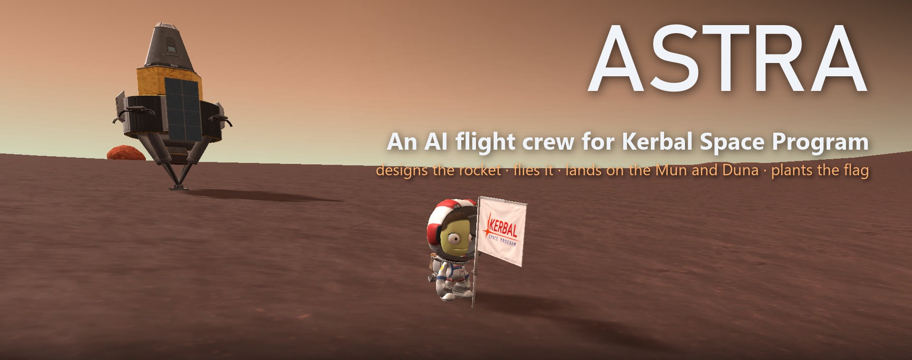
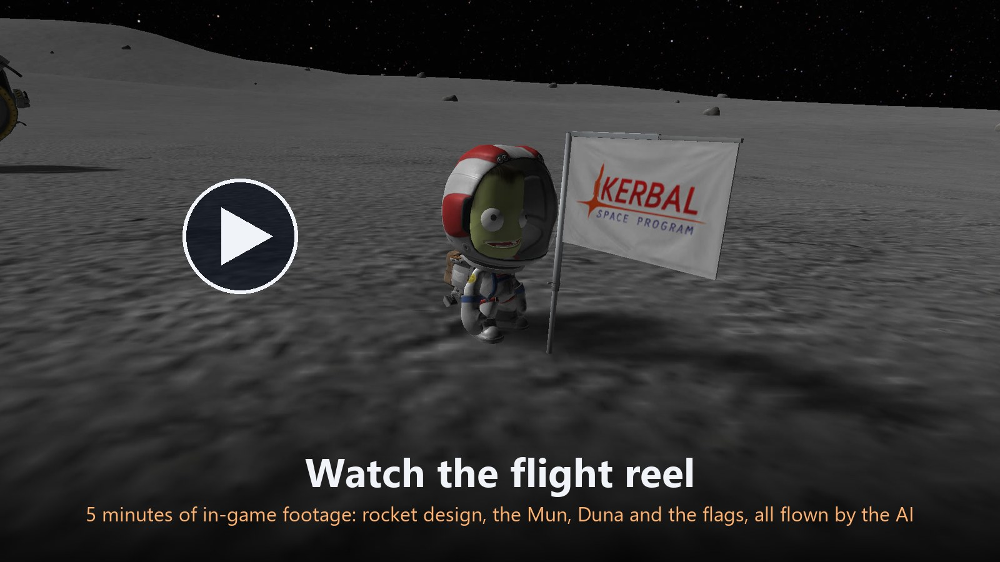
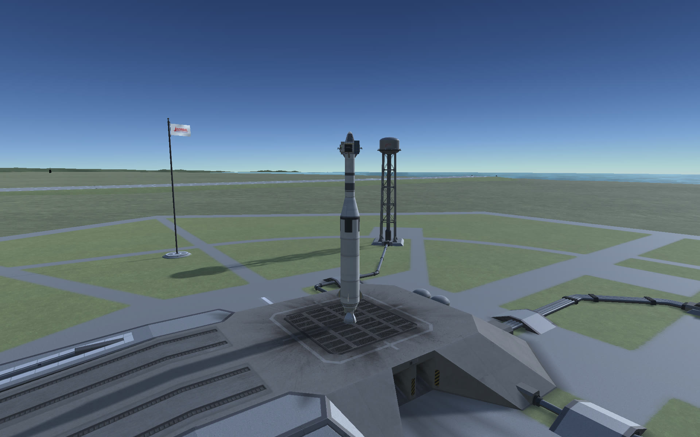
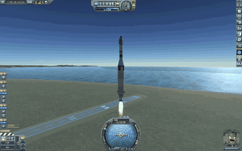
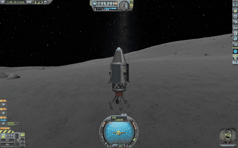
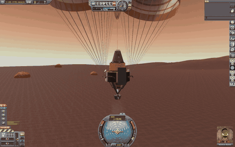
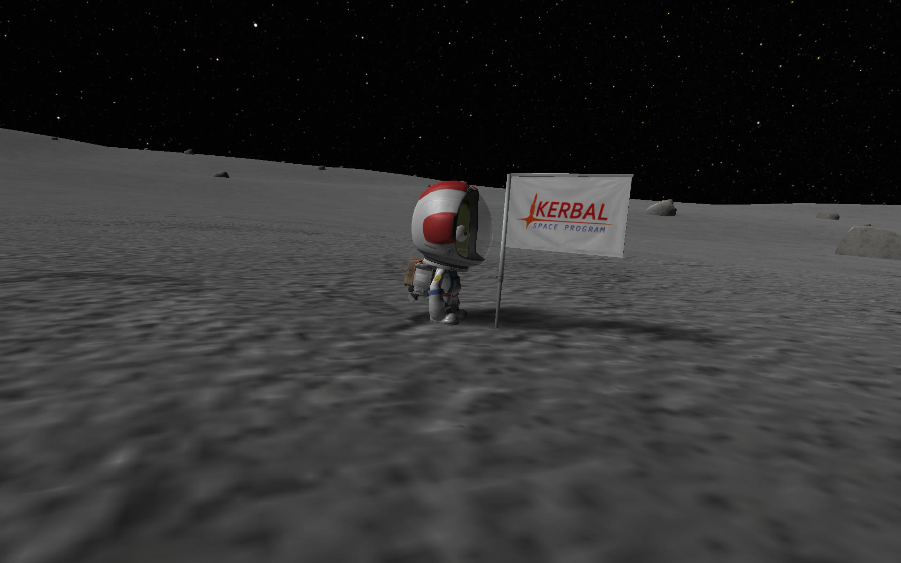
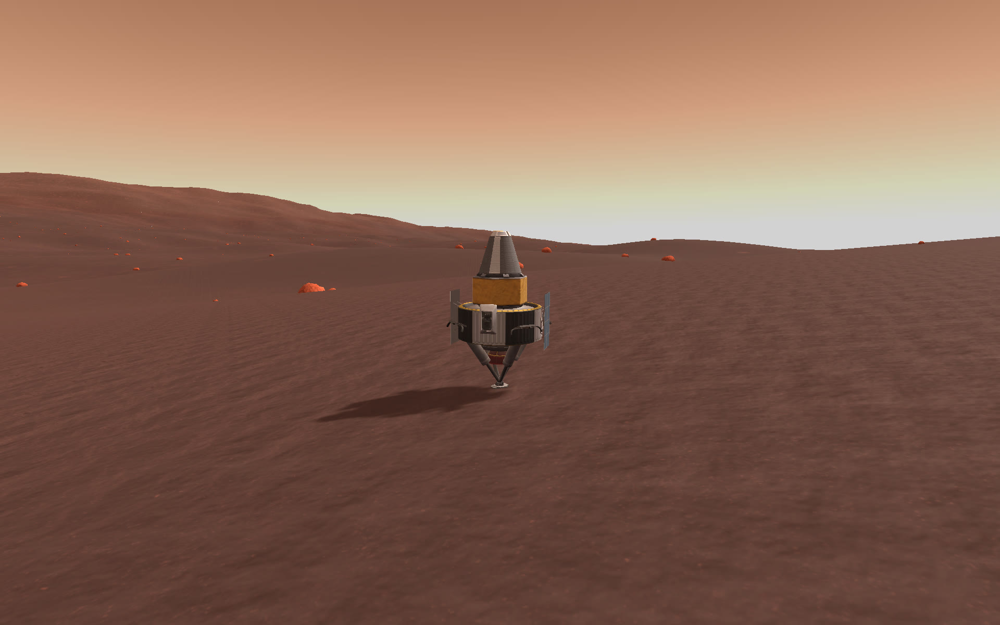
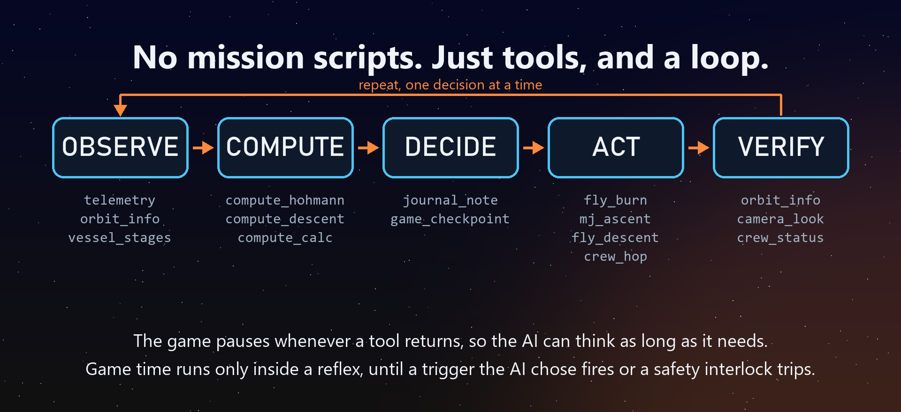
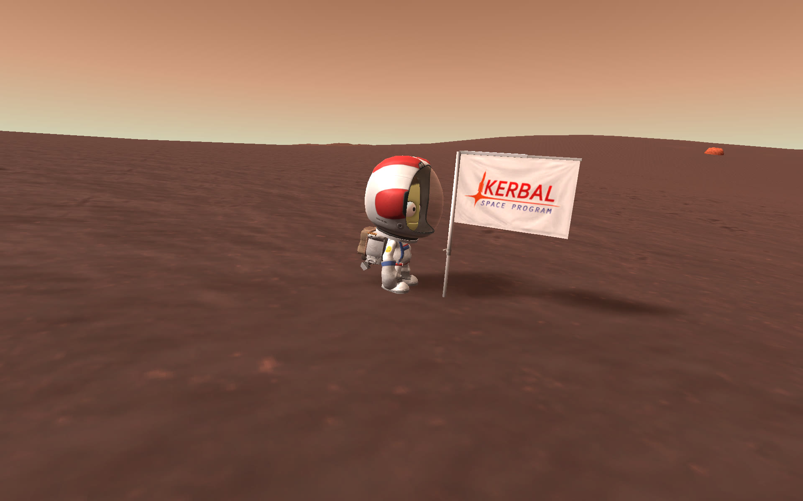

<div align="center">



English | [简体中文](README.zh-CN.md)

### Give Claude a running game of Kerbal Space Program, and it flies the mission itself.

74 tools, one loop (observe, compute, decide, act, verify), and a game that pauses while the AI thinks.

[](https://www.kerbalspaceprogram.com/)
[](https://www.python.org/)
[](https://modelcontextprotocol.io/)
[](https://krpc.github.io/krpc/)
[](LICENSE)

[What it does](#what-it-does) · [Quick start](#quick-start) · [How it works](#how-it-works) · [Flights](#the-flights) · [What went wrong](#what-went-wrong-and-what-it-learned) · [Tool reference](docs/TOOLS.md)

</div>

ASTRA turns a running game of Kerbal Space Program 1 into 74 MCP tools: instruments, calculators,
controls and short reflexes. Claude uses them as astronaut and mission control. It reads the live
part catalog and designs the rocket, launches it, plans the transfer, lands with ASTRA's own
powered-descent reflex, sends a kerbal out to plant a flag, and flies Jebediah home from the Mun.
Its rule is to compute every number from live telemetry rather than recall it.

<p align="center">
  <a href="https://github.com/shoal-rat/astra-ksp/releases/tag/v2.0.0">
    
  </a>
  <br>
  <sub>About 5 minutes, 1920×1080, English narration. In-game recordings and screenshots, with
  title, diagram and flight-log cards between them; in flight, the tool the AI was calling shows
  top right and the telemetry at that moment bottom left. The thumbnail opens the
  <a href="https://github.com/shoal-rat/astra-ksp/releases/tag/v2.0.0">v2.0.0 release</a>, where
  <code>astra_showcase_en.mp4</code> is a 161 MB download (<code>astra_showcase.mp4</code> is the
  Chinese cut).</sub>
</p>

<details>
<summary>Video chapters</summary>

| Time | Chapter |
|---|---|
| 00:00 | A flag on Duna |
| 00:22 | What is ASTRA? |
| 00:46 | How the AI thinks |
| 01:17 | The AI designs a rocket |
| 01:42 | MechJeb launch to orbit |
| 02:01 | Bound for the Mun |
| 02:13 | Powered landing |
| 02:39 | Failures and lessons |
| 02:59 | A flag on the Mun |
| 03:12 | Return and reentry |
| 03:26 | Landing on Duna (Mars) |
| 04:17 | One command, fully autonomous |
| 04:39 | Open source on GitHub |

</details>

On Duna, KSP's Mars, a flag stands in the Midland Sea at 6.97 N 39.95 W. The AI wrote its plaque:

> *First crewed landing on Duna by ASTRA, an AI flight crew: rocket designed, flown, and landed by
> AI. Valentina Kerman, 2026-09-30*

There was no mission script. There is no mission script anywhere in this repository, and the AI is
not allowed to write one.

## By the numbers

<table>
<tr>
<td align="center" width="25%"><h3>74</h3>MCP tools in 9 groups</td>
<td align="center" width="25%"><h3>0</h3>mission scripts in the repository</td>
<td align="center" width="25%"><h3>473</h3>tool calls in the published flight logs</td>
<td align="center" width="25%"><h3>8</h3>flight logs, all published: 5 successful, 3 aborted</td>
</tr>
<tr>
<td align="center"><h3>80.3 × 79.6 km</h3>Kerbin orbit (apoapsis × periapsis) on a rocket the AI designed</td>
<td align="center"><h3>0.03 m/s</h3>vertical speed at touchdown on the Mun (Lander 4, which tipped over later)</td>
<td align="center"><h3>1.22 m/s</h3>touchdown on Duna, 0.01 m/s sideways</td>
<td align="center"><h3>377 days</h3>from launch to Duna touchdown (Kerbin days of 6 hours)</td>
</tr>
</table>

## What it does

<table>
<tr>
<td width="50%"></td>
<td width="50%">
<h3>Designs its own rocket</h3>
It searches the live part catalog (<code>parts_search</code>, <code>part_info</code>) and writes
the part tree. <code>design_check</code> returns Δv and TWR for every stage and checks steering
authority and power; <code>design_build</code> writes the <code>.craft</code>. On the pad the AI
compares <code>vessel_stages</code> with the design.
<br><br>
<sub>Orbiter 1 could not steer. The AI worked out why, redesigned it around a gimbaled engine, and flew again.</sub>
</td>
</tr>
<tr>
<td width="50%">
<h3>Flies it to orbit</h3>
MechJeb can fly the ascent: the AI chooses every setting, the tool's reply echoes MechJeb's
effective settings, and ASTRA's interlocks watch the climb. Or the AI flies the climb itself in
<code>fly_until</code> segments, on a pitch program it wrote, as it did on both orbiters.
<br><br>
<sub>Orbiter 2: 80.3 × 79.6 km, e = 0.0005. Orbiter 3, flown unattended: 81.66 × 79.97 km, i = 0.18°.</sub>
</td>
<td width="50%"></td>
</tr>
<tr>
<td width="50%"></td>
<td width="50%">
<h3>Lands on ASTRA's own guidance</h3>
<code>fly_descent</code> is ASTRA's own powered-landing reflex: it predicts the suicide burn by
integrating it step by step, keeps watch on the highest ground ahead, hovers a few meters up until
the drift is below the limit the AI set, then sets the lander down upright and leaves SAS holding
it.
<br><br>
<sub>Mun touchdowns with this guidance: 0.86 m/s (Lander 3) and 0.03 m/s (Lander 4), vertical.</sub>
</td>
</tr>
<tr>
<td width="50%">
<h3>Goes interplanetary</h3>
It picks a Lambert transfer window, refines the node on KSP's patched conics and burns 1,091 m/s
to leave Kerbin. Two mid-course corrections (16.5 m/s, then 0.83 m/s) line up the approach, and
the 713 m/s capture burn drops the empty transfer stage mid-burn through the auto-staging the AI
enabled. Duna's thin air brakes the lander to 411 m/s at 6 km above the ground, three parachutes
open, and the engine sets it down at 1.22 m/s.
</td>
<td width="50%"></td>
</tr>
<tr>
<td width="50%"></td>
<td width="50%">
<h3>Sends a kerbal outside</h3>
<code>crew_eva</code> with a jetpack hop that carries the kerbal clear of the lander,
<code>crew_walk</code> to a bearing or to coordinates, <code>crew_plant_flag</code> with a plaque
the AI writes, and <code>crew_board</code> to climb back in. The bridge drives the stock EVA
controls through a Harmony patch.
</td>
</tr>
<tr>
<td width="50%">
<h3>Checks its work and keeps a log</h3>
A burn reports the Δv it actually applied. A launch reports who is actually aboard. A flag counts
when a flag exists in the game. Every tool call goes into the mission's <code>log.jsonl</code>;
decisions go into <code>journal.md</code> and onto a CAPCOM panel inside the game (F8), where you
can answer.
<br><br>
<sub>ASTRA Duna 1 after touchdown: upright at 89.8°, all 13 parts, SAS settled.</sub>
</td>
<td width="50%"></td>
</tr>
</table>

## Quick start

**You need**

- Windows
- Kerbal Space Program 1.12.5 with **kRPC 0.5.4**, **MechJeb2**, **ModuleManager** and **Harmony**
  (`GameData/000_Harmony`, for walking and jetpack hops)
- this repo's **KspAutomationBridge** plugin (built in step 2, or the prebuilt 2.1.0 zip)
- Python 3.11+
- Claude Code, signed in. The autonomous runner reuses that local login, so no API key is needed.

ASTRA looks for KSP in the default Steam folder, then for a running `KSP_x64.exe`; set
`ASTRA_KSP_DIR` if yours is elsewhere.

**1. Clone and install.** The extras are `agent` (Claude Agent SDK), `media` (imageio-ffmpeg, for
filming) and `dev` (pytest).

```bash
git clone https://github.com/shoal-rat/astra-ksp.git
```

```bash
cd astra-ksp
```

```bash
python -m venv .venv
```

```bash
.venv/Scripts/python.exe -m pip install -e ".[agent,media,dev]"
```

**2. Build and install the bridge plugin.** KSP must be closed, because it memory-maps the DLL.
This compiles against your KSP install with the in-box .NET Framework compiler (`csc.exe`
v4.0.30319), copies the DLL into `GameData/KspAutomationBridge/Plugins/` and `MechJebForAll.cfg`
into `GameData/KspAutomationBridge/`. Or take the prebuilt `KspAutomationBridge-2.1.0.zip`
(GameData layout) from the [v2.0.0 release](https://github.com/shoal-rat/astra-ksp/releases/tag/v2.0.0).

```bash
.venv/Scripts/astra.exe bridge install
```

**3. Optionally, make a clean save; then start the game.** `newsave` copies the game settings and
roster of an existing save (`--from` names its folder), without its vessels. On a KSP install
localized to Chinese, the stock save folder may be named `默认` rather than `default`. `up` starts
KSP if needed, waits for the bridge and loads the save.

```bash
.venv/Scripts/astra.exe newsave astra --from default
```

```bash
.venv/Scripts/astra.exe up --save astra
```

**4. Fly.** Pick one of three ways.

- **Talk to the crew in Claude Code.** Open Claude Code in the `astra-ksp` folder. `.mcp.json`
  starts the `astra` MCP server and `CLAUDE.md` makes the session the flight crew. Say what you
  want, for example *"Land a kerbal on the Mun, plant a flag and bring them home."* You are the
  flight director: the crew asks you at real decision points and flies the rest.
- **Autonomous mission.** A Claude Agent SDK crew flies the goal on its own, using your local
  Claude Code login:

  ```bash
  .venv/Scripts/astra.exe mission "land on the Mun and return"
  ```

  The crew has only the astra tools, plus the `booster-engineer` and `fido` specialist subagents:
  no shell and no file access, so it cannot script. The flight log and transcript land in
  `missions/<timestamp>-<goal>/`. Add `--record` to film it.
- **By hand.** Start the daemon so control inputs persist between calls, then call tools:

  ```bash
  .venv/Scripts/astra.exe serve --http
  ```

  ```bash
  .venv/Scripts/astra.exe call telemetry detail=brief
  ```

`astra tools -v` prints every tool with its full description; [`docs/TOOLS.md`](docs/TOOLS.md) is
the same reference as a document. Using another MCP client? [`AGENTS.md`](AGENTS.md) shows the same
server registered in Codex.

## How it works

<p align="center">
  
</p>

### The world stops while the AI thinks

A language model needs seconds to answer; a rocket in the atmosphere does not wait. So ASTRA
pauses the game every time a tool returns, and the bridge does it without KSP's ESC menu.
Telemetry reads, maneuver-node edits and control changes still work while paused. Game time runs
only inside the reflexes (`fly_*`), inside MechJeb tools run with `watch`, and during crew actions
such as a walk; staging, a checkpoint or a vessel switch runs a moment of it. In the Duna log
below, 4 h 43 min of real time pass between two calls while the lander hangs 38 km above Duna in
the middle of its entry. One reflex ended at 942.851 m/s; the next started at 942.852 m/s.

<details>
<summary>Exactly which calls run game time</summary>

<br>

| The AI calls | Game time that runs |
|---|---|
| `fly_until`, `fly_burn`, `fly_descent` | until one of the AI's triggers fires or the maneuver completes, an interlock trips, or a time bound the AI set runs out |
| `fly_warp` | until the time or event the AI asked for; in flight it stops early at the atmosphere, or at a floor altitude over an airless body |
| `mj_*` autopilots with `watch: true` | until MechJeb reports the autopilot idle, a `stop_when` trigger fires, an interlock trips, or `max_game_s` passes |
| `crew_eva`, `crew_walk`, `crew_hop`, `crew_plant_flag`, `crew_board`, `crew_transfer` | until the kerbal stands, arrives or is seated (a walk can take minutes) |
| `control_stage`, `control_part` | a few physics frames, so a staged or decoupled vessel can split |
| `control_attitude` with `wait_aligned_deg` | until the pointing error stays below that angle |
| `game_switch_vessel`, `game_restore`, `game_checkpoint` | a moment (1 s for a restore, 0.2 s for a checkpoint) |
| instruments, calculators, node edits and the journal: `telemetry`, `orbit_info`, `compute_*`, `node_create`, `journal_note`, … | none |

</details>

### Reflexes: the AI sets the stop

Anything that changes faster than a model can think is flown by a **reflex**: a ~20 Hz control
loop on kRPC streams that runs the laws the AI commands until one of the AI's triggers fires,
either a metric condition such as `surface_altitude <= 6000` or an event such as `flameout` or
`landed`. Then it pauses the game and reports why it stopped, what it saw, and the final state.

| Reflex | What it flies |
|---|---|
| `fly_until` | throttle laws (a TWR hold, "drive apoapsis to a target and feather") and attitude laws (a pitch table the AI wrote, surface prograde with pitch clamps, a node vector) until a trigger fires |
| `fly_burn` | a maneuver node: warps to it, turns to the burn vector, ignites only if aligned in time (a late burn along a node's fixed vector bends the orbit), feathers the cutoff, and reports the Δv it applied |
| `fly_warp` | time warp that stops early rather than enter an atmosphere, or sink below the AI's floor altitude over an airless body |
| `fly_descent` | powered landing: a numerically integrated suicide-burn predictor, terrain look-ahead, height-first braking, a hover to cancel drift, SAS after contact |

**Interlocks** sit under every reflex: flameout, part loss, SOI change, overheating, impact risk,
loss of control, low power. They never act; they stop the reflex and hand control back. Five
tripped in the published flights, three of them in the first orbital mission. Loss of control
stopped Orbiter 1's climb at 7.3 km. Low power stopped Orbiter 2's deorbit burn before the engine
lit. The impact interlock stopped the capsule at 999 m
(`impact: ground in 6.2 s at 162 m/s descent; parachutes: deployed`), just as its Mk16 reached the
1,000 m altitude where it opens fully; the AI re-issued that segment with `"impact": null`, and the
capsule splashed down at 3.9 m/s. The other two were overheat stops during Mun Lander 3's MechJeb
ascent (a part at 95%, then 99%, of its maximum temperature).

**Staging stays the AI's call.** A reflex stages on its own only if the AI enabled `auto_stage`,
and only when the next stage lights an engine while dropping no more than 50 kg of propellant, or
drops only empty parts while another engine keeps burning. At Duna the transfer stage ran dry
108.1 s into the capture burn; the reflex staged, and the lander's engine finished the burn.

<details>
<summary>Interlock defaults</summary>

<br>

The AI can relax any of them for a segment where it expects that condition (`false` or `null`
disables one):

```json
{"flameout": true, "part_lost": true, "soi_change": true, "overheat": 0.95,
 "impact": {"seconds": 10, "speed_mps": 12},
 "loss_of_control": {"error_deg": 25, "seconds": 4, "min_q_pa": 3000},
 "low_power": 0.02, "dry_debounce_s": 0.4}
```

</details>

<details>
<summary>How <code>fly_descent</code> lands</summary>

<br>

- **Braking.** A suicide-burn predictor integrates a surface-retrograde burn at (1 − reserve) × max
  thrust under gravity, less the centrifugal relief of the horizontal speed. The engine stays off
  while the predicted stop ends above the gate, then burns at the lowest throttle that still holds
  it.
- **Terrain ahead.** The gate sits `terminal_alt_m` above the highest ground sampled along the track
  ahead, out past the predicted stop, with peaks remembered until passed.
- **Height-first braking.** When full retrograde thrust cannot hold the gate, the vertical thrust
  holds a sink it can still stop and the rest kills horizontal speed.
- **Terminal phase.** Sink proportional to the height above the ground, tilting against drift. A few
  meters up it hovers until the drift is below `touchdown_drift_mps`, then sets down upright.
- **After contact.** The engine is cut, the reflex runs 4 more game seconds, then leaves the
  autopilot off and SAS holding the settled attitude.
- Atmospheric drag is not modeled; it only helps. An offline closed-loop simulator
  ([`tests/descent_sim.py`](tests/descent_sim.py)) exercises the guidance without the game.

</details>

### Capabilities, not missions

Every tool is an instrument, a calculator, a control, or a short-horizon reflex. None of them flies
a mission, and no parameter default may encode a mission decision. Target altitudes, burn times,
pitch programs, staging, landing sites and margins are arguments the AI computes each time, with
`compute_*` tools whose results show their math. `fly_descent`, for one, makes the AI supply
`touchdown_mps`, `terminal_alt_m`, `throttle_reserve` and `touchdown_drift_mps`, and explains how
to derive them from the landing gear, the stance and the slope. There are no cheats: the previous
design's `/vessel/refuel` and `/spawn-crew` bridge routes were removed.

### Under the hood

```text
 Claude ── a Claude Code session, or `astra mission` (Claude Agent SDK)
   │
   │  MCP · 74 tools · the game is paused whenever a tool returns
   ▼
 astra (Python) ── tools · reflex engine (~20 Hz) · physics · craft writer · journal · recorder
   │                                     │
   │ kRPC 0.5.4                          │ KspAutomationBridge 2.1.0 (HTTP 127.0.0.1:48500)
   │ telemetry, control, nodes, warp     │ part database, EVA, MechJeb, pause, CAPCOM, recorder
   ▼                                     ▼
 Kerbal Space Program 1.12.5, with MechJeb2, ModuleManager and Harmony
```

The crew's rules (no scripts, compute rather than recall, a named checkpoint before anything
irreversible, report only what telemetry shows) live in
[`knowledge/doctrine.md`](knowledge/doctrine.md), and 11 playbooks teach it how to derive numbers,
never which numbers to type.

<details>
<summary>All 74 tools, by group</summary>

<br>

| Group | Count | Tools |
|---|---:|---|
| **observe**: instruments | 7 | `telemetry` `vessel_parts` `body_info` `orbit_info` `target_info` `camera_look` `vessel_stages` |
| **compute**: slide rule | 10 | `compute_calc` `compute_orbit` `compute_hohmann` `compute_rocket` `compute_descent` `compute_ascent_estimate` `compute_maneuver` `compute_node_search` `compute_transfer_window` `compute_terrain` |
| **design**: engineering desk | 6 | `parts_search` `part_info` `design_check` `design_build` `design_from_craft` `craft_list` |
| **game**: game director | 12 | `game_status` `game_load_save` `game_checkpoint` `game_restore` `game_revert` `game_launch` `game_list_vessels` `game_switch_vessel` `game_recover` `game_space_center` `game_pause` `game_log` |
| **control**: direct controls | 9 | `control_set` `control_stage` `control_attitude` `control_part` `control_action_group` `node_create` `node_list` `node_delete` `target_set` |
| **fly**: reflexes | 4 | `fly_until` `fly_burn` `fly_warp` `fly_descent` |
| **autopilot**: MechJeb | 9 | `mj_ascent` `mj_execute_node` `mj_land` `mj_rendezvous` `mj_dock` `mj_plan` `mj_status` `mj_abort` `mj_stage_stats` |
| **crew**: kerbals | 8 | `crew_roster` `crew_eva` `crew_hop` `crew_status` `crew_walk` `crew_plant_flag` `crew_board` `crew_transfer` |
| **journal**: log, lessons, doctrine | 9 | `mission_start` `mission_end` `journal_note` `journal_read_doctrine` `playbook` `lessons_search` `lesson_add` `capcom_say` `capcom_inbox` |

The published flight logs record calls to 52 of the 74. The rendezvous and docking tools exist,
but no rendezvous or docking has been flown yet. Every parameter is in
[`docs/TOOLS.md`](docs/TOOLS.md), or run `astra tools -v`.

</details>

## Call by call: landing on Duna

Twenty consecutive calls from the Duna flight's
[`log.jsonl`](docs/missions/20260930-080619-land-valentina-on-duna-and-plant-a-flag-/log.jsonl),
records [36] to [55] (indexes count from 0): from a 63 × 52 km orbit to Valentina back in her seat.
Arguments and results are trimmed to the fields that matter and long values rounded; quoted text is
verbatim.

```text
── observe ─────────────────────────────────────────────────────────────────────────
[36] orbit_info       of="vessel"
     ↳ Duna · apoapsis 63,407 m · periapsis 52,142 m
[37] vessel_stages
     ↳ 6.79 t · stage 1: LV-909 (liquidEngine3.v2), 2,974 m/s vacuum Δv

── compute, then decide ────────────────────────────────────────────────────────────
[38] compute_maneuver kind="deorbit_to_periapsis" at="ut" target_alt_m=12000
     ↳ prograde -25.92 m/s · burn 2.92 s
[39] node_create      prograde_mps=-25.9231
     ↳ orbit after the node: periapsis 12,000 m · apoapsis 63,224 m
[40] game_checkpoint  name="duna1_orbit_low"
[41] journal_note     plan: "deorbit 25.9 m/s at 90 E to a 12 km periapsis; aerobrake retrograde
                      through the thin air; chutes (Mk16 + 2 Mk2-R) once below ~260 m/s; ..."

── act: deorbit burn ───────────────────────────────────────────────────────────────
[42] fly_burn         max_throttle=0.3 align_deg=3.0 max_late_s=5.0 tolerance_mps=0.05
     ↳ aligned at burn start (error 0.09 deg, 0.0 s late)
     ↳ node 25.92 m/s, applied 25.91 m/s · orbiting -> sub_orbital

── act: entry ──────────────────────────────────────────────────────────────────────
[43] fly_until        until: surface_speed <= 260  or  surface_altitude <= 6000
                      throttle=0 · attitude=surface retrograde · max_real_s=600
     ↳ timeout: "max_real_s 600 reached (game time ran 599.6 s)"
     ↳ sub_orbital -> flying · 38,033 m · 942.851 m/s

   · · ·  4 h 43 min of wall-clock time pass before the next call; the game waits, paused  · · ·

[44] fly_until        same triggers and laws · max_real_s=2400
     ↳ trigger: "surface_altitude <= 6000 (now 5988.63)" after 321.68 game s · 411.1 m/s

── decide: chutes, then powered descent ────────────────────────────────────────────
[45] journal_note     decision: "Entry brought the lander to 6.0 km above ground at 411 m/s
                      ... deploy the chutes (Mk16 + 2 Mk2-R) now and hand over at once to
                      fly_descent ..."
[46] control_stage
     ↳ parachuteSingle, parachuteRadial, parachuteRadial · 13 parts before, 13 after
[47] fly_descent      touchdown_mps=1.5 terminal_alt_m=150 throttle_reserve=0.2
                      touchdown_drift_mps=0.5 terminal_rate=0.15 max_tilt_deg=30
                      tilt_gain_deg_per_mps=10 sink_gain=0.8 legs_alt_m=3000 max_game_s=600
     ↳ touchdown: vertical -1.22 m/s, horizontal 0.014 m/s · flying -> landed
     ↳ "autopilot off at touchdown; SAS holding the settled attitude after 4 s"

── verify and secure ───────────────────────────────────────────────────────────────
[48] journal_note     result: "Touchdown on Duna, Midland Sea, 6.97 N 39.95 W: vertical
                      1.22 m/s, horizontal 0.01 m/s, upright (89.8 deg), all 13 parts ..."
     ↳ UT 1997275529 · MET 377d 04:04:41
[49] game_checkpoint  name="duna1_landed"

── EVA: hop out, plant the flag, board ─────────────────────────────────────────────
[50] crew_eva         kerbal="Valentina" hop_clear_m=6.0
     ↳ verified · hop released 0.59 m from the aim point
[51] crew_walk        bearing_deg=316.7 distance_m=6.0       ↳ arrived · can_plant_flag true
[52] crew_plant_flag  name="ASTRA Duna Base" plaque="..."    ↳ planted · Duna, Midland Sea
[53] crew_walk        lat_deg=6.9682 lon_deg=-39.9487        ↳ arrived · hatch 3.86 m away
[54] crew_status      kerbal="Valentina"                     ↳ Idle (Grounded), within reach
[55] crew_board       part="nearest"                         ↳ boarded "ASTRA Duna 1"
```

**How to read it**

- **The loop, in order.** Calls [36] to [41] observe, compute, place the node, check the orbit it
  predicts, save a checkpoint and write the plan, all before any reflex runs.
- **The AI picks when a reflex stops.** The entry ends at 260 m/s *or* 6 km above the ground,
  whichever comes first. The 6 km trigger fired, at 411 m/s.
- **A bound is a pause, not a failure.** Call [43] hit its own wall-clock bound 38 km up and handed
  control back; the AI re-issued it with a longer bound, and [44] picked up where [43] had stopped.
- **Every guidance number is an argument.** Call [47] lists every parameter of the landing, each one
  chosen by the AI. Call [49] saves a checkpoint before anyone opens a hatch.

The flight closed with `mission_end`: `"outcome": "success"`, `"tool_errors": 0`.

<p align="center">
  
  <br>
  <sub>The result of call [52]: Valentina Kerman and "ASTRA Duna Base" in the Midland Sea,
  377 Kerbin days (of 6 hours) after launch.</sub>
</p>

## The flights

Every flight below was flown through the tools. Each folder in [`docs/missions/`](docs/missions/)
holds the `journal.md` the crew wrote as it flew and a `log.jsonl` with every tool call, its
arguments and its result (results longer than 6,000 characters are cut short). The autonomous run
also keeps its full transcripts.

| Flight | What happened | Calls | Outcome |
|---|---|---:|---|
| **[Orbiter 2](docs/missions/20260929-233547-design-a-crewed-rocket-from-the-live-par/)**<br><sub>Jebediah · design, orbit, return</sub> | Orbiter 1 lost control at 7.3 km (nothing on the booster gimbaled); the AI restored the pad checkpoint and rebuilt it around a Swivel. Orbit at 80.3 × 79.6 km, a deorbit steered on engine gimbal alone after the capsule ran out of power, splashdown at 3.9 m/s. | 68 | success |
| **[Orbiter 3](docs/missions/20260930-000855-design-a-crewed-rocket-from-the-live-par/)**<br><sub>Valentina · same goal, unattended (`astra mission`)</sub> | Flown unattended by a Claude Agent SDK crew with only the ASTRA tools. It added batteries and solar panels, flew the climb itself to 81.66 × 79.97 km and brought Valentina home under the chute. The first session dropped after 37 turns and was resumed. | 64 | success |
| **[Mun Lander 1](docs/missions/20260930-025706-crewed-mun-landing-and-return-land-jebed/)**<br><sub>Jebediah · Mun landing and return</sub> | MechJeb ascent and trans-Mun injection. Descent 1 hovered at 13 km, descent 2 met rising terrain, descent 3 landed at 1.5 m/s. Flag "ASTRA Mun Base 1". The narrow lander tipped twice on a 5.7° slope and was restored from checkpoints; splashdown at 4.4 m/s. | 101 | success |
| **[Mun Lander 2](docs/missions/20260930-041640-showcase-crewed-mun-landing-and-return-w/)**<br><sub>four legs, narrow</sub> | Landed in Farside Crater at 1.4 m/s on the old constant-deceleration guidance, then tipped over: 2.1 m/s of drift on a 4° slope. | 44 | aborted |
| **[Mun Lander 3](docs/missions/20260930-052437-showcase-crewed-mun-landing-and-return-w/)**<br><sub>wide 2.5 m base</sub> | The old guidance crashed it at 118 m/s. The new suicide-burn predictor landed it at 0.86 m/s, 0.05 m/s sideways, upright. Jebediah climbed out onto the tank ledge, and walking off it tipped the lander twice. | 66 | aborted |
| **[Mun Lander 4](docs/missions/20260930-061439-showcase-crewed-mun-landing-and-return-w/)**<br><sub>narrow, six legs</sub> | Touchdown at 0.03 m/s. The first jetpack hop carried Jebediah clear without touching the lander, and it tipped anyway: with the pilot out there was no SAS. | 43 | aborted |
| **[Mun Lander 3, continued](docs/missions/20260930-074333-showcase-continued-lander-3-surface-oper/)**<br><sub>Jebediah · flag and return</sub> | Resumed from the landed checkpoint: jetpack hop, flag "ASTRA Mun Base". The lander tipped once the pilot left, so, as the journal records, the return was flown from the pre-EVA checkpoint with the lander upright, a restore that also rolled the flag back. Chute landing on Kerbin. | 30 | success |
| **[Duna 1](docs/missions/20260930-080619-land-valentina-on-duna-and-plant-a-flag-/)**<br><sub>Valentina · one-way</sub> | Lambert window, 1,091 m/s ejection, two mid-course corrections, 713 m/s capture into 63 × 52 km. Aerobraking, three parachutes, powered touchdown at 1.22 m/s. A probe core kept SAS on through the EVA, the flag "ASTRA Duna Base" and boarding. One-way: no ascent vehicle for Duna's gravity well. | 57 | success |
| **Total** | 8 flight logs | **473** | 5 successful, 3 aborted |

<sub>A call is one line of the mission's <code>log.jsonl</code>, failed calls included (13 across all
eight flights). Calls made before <code>mission_start</code> go to a separate
<code>_unassigned</code> log, not the mission's. The three aborted flights were ended on purpose in
favor of another lander.</sub>

## What went wrong, and what it learned

Three of the eight flights were aborted, and the logs keep every failed attempt next to the
successes. Each problem ended up as a lesson in [`knowledge/lessons.md`](knowledge/lessons.md), a
fix in the [CHANGELOG](CHANGELOG.md), or both.

- **A rocket that would not turn.** Orbiter 1's pitch program asked for 57° at 7.3 km while the
  rocket still pointed 84° up: neither the LV-T30 Reliant nor the RT-10 Hammers gimbal. The AI
  restored the pad checkpoint and rebuilt the core around the gimbaled LV-T45 Swivel.
  `design_check` now checks steering authority.
- **A capsule that ran flat.** Orbiter 2 drained its 65 units of ElectricCharge holding attitude
  through a 23-minute coast. The AI flew the deorbit with `fly_until`, steering on the Terrier's
  gimbal alone. `design_check` now checks power, and the next orbiter carried batteries and solar
  panels.
- **A hover at 13 km.** Mun Lander 1's first descent hovered at 13 km for its full 600 s: kRPC's
  `Vessel.bounding_box` came back as ±6×10¹⁷ m because the stock Mk1 pod reports a broken bound.
  Vessel boxes are now built from sane per-part boxes (`telemetry.vessel_box`).
- **Terrain ahead.** A 570 m/s approach brakes over about 15 km, and a 450 m rise under that path
  caught a flat-ground profile at full throttle. `fly_descent` now samples the highest ground along
  the track, out past the predicted stop; the next descent landed at 1.5 m/s.
- **A crash at 118 m/s.** A constant-deceleration model hit the Mun with Lander 3, a TWR-5.4 lander,
  at 118.6 m/s sideways. Braking is now a numerically integrated suicide-burn predictor with
  height-first braking, covered by an offline closed-loop simulator
  ([`tests/descent_sim.py`](tests/descent_sim.py)) and regression cases from an adversarial review.
  The same lander then touched down at 0.86 m/s.
- **Landers that fell over.** Four Mun landers tipped after touchdown: on a 5.7° slope, with
  2.1 m/s of drift, when Jebediah walked off a tank ledge, and after a jetpack hop that never
  touched the lander. Every tip-over coincided with an active-vessel change or a reload, and with
  the pilot out there was no SAS. The fix, confirmed on Duna: a probe core with SAS on a wide
  lander, drift canceled before contact, and a hop straight out of the hatch. The Duna lander
  stayed within 0.6° of vertical (89.4°) through the EVA, the flag and boarding.
- **An asteroid after a restore.** A checkpoint taken right after boarding came back with an
  asteroid as the active vessel: KSP had saved before the vessel switch completed. Checkpoints and
  restores now let physics settle around vessel switches.
- **Kerbals the tools could not see.** kRPC's vessel list omits EVA kerbals and flags, so every EVA
  and flag check now goes through the bridge. The walker now steers the kerbal's facing too.
- **A jetpack too weak for Duna.** The newest lesson: "The stock EVA pack gives about 0.94 g on
  Duna (2.76 of 2.92 m/s^2): it cannot take off from the ground". So on Duna the hop now glides
  out from the hatch instead.

Lessons carry over between flights. `mission_start` hands the crew the ones that match the goal;
for Duna it returned eight, the first from a flight of the previous design: *"A tall, narrow
single-stack lander tipped over on Duna, burying the hatch…"*. The Duna lander was wide and carried
a probe core. The autonomous crew explained its own Orbiter 3 design in its final report
([transcript](docs/missions/20260930-000855-design-a-crewed-rocket-from-the-live-par/transcript-20260930-020636.jsonl)):

> I added the power because an earlier flight's capsule ran flat during a long coast.

`knowledge/lessons.md` now holds 206 one-line lessons: 178 harvested from the previous project's
June 2026 flights and 28 written during the live flights of 29 and 30 September 2026.

## Filming with `astra record`

The bridge renders the game's cameras off-screen, reads each frame back asynchronously
(`AsyncGPUReadback`, ~2–3 ms of main-thread time per frame) and pipes it to ffmpeg as H.264. It
takes no frames while the game is paused, so the AI's deliberation never appears in the footage. A
camera director frames each phase (a slow orbit around the vehicle, close on a kerbal, low over the
ground when landing) and only ever moves the camera, never the flight controls.

Each recording lands in `recordings/<timestamp>/`: `video.mkv`, `frames.csv` (UT and vessel state
for every frame) and `marks.csv` (the start and end of every tool call except the read-only
instruments). The showcase video (1920×1080, 30 fps) was cut from these files by
[`scripts/showcase/make_video.py`](scripts/showcase/make_video.py), HUD and `AI ▶ tool(...)`
captions included. Filming needs ffmpeg: the `media` extra installs `imageio-ffmpeg`, or use one on
PATH.

```bash
.venv/Scripts/astra.exe record --dir recordings/my-flight
```

```bash
.venv/Scripts/astra.exe mission "land on the Mun and return" --record
```

<details>
<summary>Recorder options</summary>

<br>

| Option | Default | Meaning |
|---|---|---|
| `--dir` | `recordings/<timestamp>` | output folder: `video.mkv`, `frames.csv`, `marks.csv` |
| `--fps` | 15 | frames per real second |
| `--width` / `--height` | 1728 / screen aspect | frame size |
| `--crf` | 20 | H.264 quality (lower is better) |
| `--jpeg` | off | JPEG frames instead of video, ~20–40 ms of KSP's main thread each (also the fallback without ffmpeg) |
| `--no-ui` | off | leave out the game UI |
| `--no-director` | off | do not move the camera |
| `--stop` / `--status` | | stop the running recording, from another terminal / show the recorder's state |

The recorder stops by itself when free disk falls below 3 GB, when ffmpeg exits, or when KSP quits.
The director leaves the camera alone while the file `.cache/director.hold` exists.

</details>

## Repository layout

<details>
<summary>Where things live</summary>

<br>

| Path | What |
|---|---|
| `src/astra/registry.py`, `server.py`, `cli.py` | tool registry, MCP server (stdio or HTTP daemon), CLI |
| `src/astra/ksp.py`, `bridge.py`, `telemetry.py` | the live link: one kRPC connection, the bridge client, stream-backed instruments |
| `src/astra/reflex/` | the reflex engine: control laws, triggers, events and interlocks, burn executor, warp, powered descent |
| `src/astra/physics/` | pure orbital mechanics, rocket math, Lambert solver, safe calculator |
| `src/astra/craft/` | ConfigNode parser, part catalog (live prefab data), craft spec, staging, stage simulator, `.craft` writer |
| `src/astra/tools/` | the tools, one module per group |
| `src/astra/agent/` | the autonomous crew runner (Claude Agent SDK) |
| `src/astra/media.py` | recording control, tool-call marks, the camera director |
| `knowledge/` | `doctrine.md` (how the crew works), `playbooks/` (10 physics playbooks, one per phase, plus a tools cheat-sheet), `lessons.md` (flight lessons) |
| `.claude/agents/` | the `booster-engineer` and `fido` specialist subagents |
| `csharp/KspAutomationBridge/` | the KSP plugin for what kRPC lacks: part database with geometry, EVA (walk, jetpack hop, flags, boarding), MechJeb, scene control, CAPCOM panel, screenshots, video recorder |
| `docs/` | `ARCHITECTURE.md`, `BRIDGE_API.md`, `TOOLS.md` (generated), `missions/` (flight logs), `media/` |
| `scripts/showcase/` | the storyboard and builder for the showcase video |
| `tests/` | offline tests, including a closed-loop landing simulator |

</details>

## Development

```bash
.venv/Scripts/python.exe -m pytest -q tests csharp/KspAutomationBridge/Tests
```

Tests run offline: they never launch, load, save, warp or change the game. Read
[`docs/ARCHITECTURE.md`](docs/ARCHITECTURE.md), the binding contract, before adding a tool. In
short: tools are synchronous functions registered with `@tool("<group>")`, every parameter carries
a description written for the AI, results are SI with unit-suffixed keys, expected failures raise
`AstraError(message, hint)`, and no parameter default may encode a mission decision. There is no
place for a mission script, a fixed ascent or landing program, or a cheat such as refueling or
spawning crew. [`docs/TOOLS.md`](docs/TOOLS.md) is generated with `astra tools --markdown`, and
[`docs/BRIDGE_API.md`](docs/BRIDGE_API.md) documents every bridge endpoint.

## Credits

ASTRA stands on the work of others:

- [**Kerbal Space Program 1.12.5**](https://www.kerbalspaceprogram.com/), the game it flies.
- [**kRPC 0.5.4**](https://krpc.github.io/krpc/): telemetry, control, maneuver nodes and warp.
- **MechJeb2**: the ascent, node-executor, landing, rendezvous, docking and planner autopilots behind
  the `mj_*` tools.
- **ModuleManager**: applies `MechJebForAll.cfg`, which gives every command part a MechJeb core.
- **Harmony**: lets the bridge patch the stock EVA controls to walk kerbals and fly jetpack hops.
- The [**Model Context Protocol**](https://modelcontextprotocol.io/) Python SDK, pydantic and Pillow;
  **Claude Code** and the **Claude Agent SDK** for the crew; **imageio-ffmpeg** for filming;
  **edge-tts** for the showcase video's narration.
- **Claude**, who flew every mission in [`docs/missions/`](docs/missions/).

## License

MIT. Copyright (c) 2026 Weike Zhang. See [LICENSE](LICENSE).
