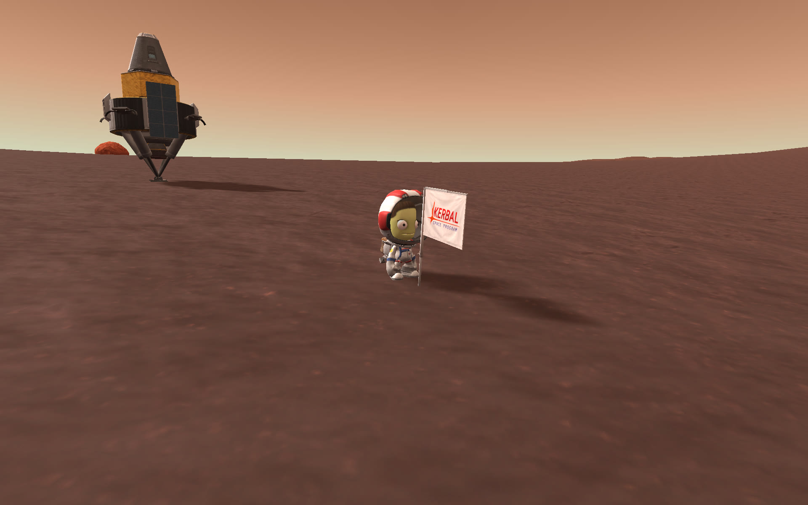
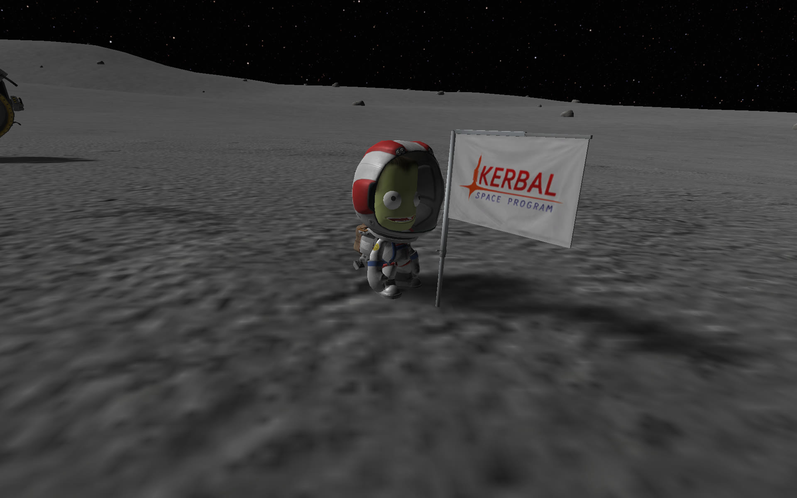

# ASTRA: an AI flight crew for Kerbal Space Program 1

> The AI is the astronaut and mission control. It designs the rocket from the live part catalog,
> builds it, launches it, flies to the Mun and to Duna, lands, sends a kerbal out to plant a flag,
> and comes home. It does all of this **by calling tools in a loop** (observe, compute, decide,
> act, verify), with every number worked out from live telemetry. The repository contains no
> mission scripts, and the AI is not allowed to write any.

[](https://www.kerbalspaceprogram.com/)
[](https://www.python.org/)
[](https://modelcontextprotocol.io/)
[](https://krpc.github.io/krpc/)
[](LICENSE)



*Duna (KSP's Mars), Midland Sea. The AI designed this lander, flew it 329 days to Duna,
landed it under parachutes and engine at 1.2 m/s, and sent Valentina out to plant the flag. This
is an unedited game screenshot.*

**Video (Chinese, ~5 min):** see the [v2.0.0 release](https://github.com/shoal-rat/astra-ksp/releases/tag/v2.0.0)
for `astra_showcase.mp4`, which covers the whole flow from rocket design to the Mun and Duna.

## 中文简介

ASTRA 把一局正在运行的《坎巴拉太空计划》（KSP 1）变成一组 **工具**（MCP tools），让 AI（Claude）
以 **宇航员 + 地面飞控中心** 的身份，亲自完成从火箭设计、发射、入轨、奔月/奔火、着陆、出舱插旗到返航的全过程。

- **不写固定程序。** 仓库里没有任何任务脚本。AI 每一步都先读遥测，再用计算工具临场计算
  （活力公式、火箭方程、霍曼转移、兰伯特窗口、制动预测……），然后下达指令并核验结果。
- **暂停思考。** 控制权交还给 AI 时游戏自动暂停，思考不消耗游戏时间。游戏时间只在 `fly_*`
  反射动作里前进，直到 AI 自己设定的触发条件（如"远地点 ≥ 80 km""进入杜娜引力圈"）或安全联锁
  （熄火、解体、过热、将撞地、失控、断电）触发为止。
- **自己设计火箭。** AI 从游戏里读取真实零件数据（挂点坐标、推力、比冲、燃料），写出零件树，
  由工具算出每级 Δv/推重比并生成 `.craft`，上发射台后再与设计核对。
- **MechJeb 自动驾驶** 负责上升和机动节点执行，但每个参数都由 AI 决定并全程监视。
- **自研动力着陆 `fly_descent`**：实时数值积分预测制动、扫描前方地形、低推重比时高度优先、
  触地前悬停消除横向漂移、落地后 SAS 稳定。月球触地速度 0.03 m/s，杜娜 1.22 m/s。
- **出舱插旗**：行走、背包喷气跳离着陆器（避免踩翻）、插旗、回舱，全部是工具调用。
- **自动录像**：`astra record` 在游戏内录制 1080p H.264 视频，自动运镜，并把 AI 的每次工具调用打点，
  本仓库的演示视频就是这样剪出来的。
- **三种用法**：在本仓库里打开 Claude Code 直接对话飞行；`astra mission "目标"` 让 Claude 全自动执行；
  或用 `astra call` 手动调用任一工具。

## Highlights

| Launch (MechJeb ascent, AI-chosen settings) | Mun touchdown (`fly_descent`) | Duna: parachutes + powered touchdown |
|---|---|---|
|  |  |  |

| On the pad | Jebediah and the flag on the Mun | The Duna lander after touchdown |
|---|---|---|
|  |  |  |

## How it works

```text
            ┌──────────────── AI crew (Claude) ─────────────────┐
            │  observe → compute → decide → act → verify → ...   │
            └───────┬────────────────────────────────────────────┘
                    │ 74 MCP tools; the game is paused while the AI thinks
     ┌──────────────┼──────────────────────────────────────────────────┐
     │ observe   telemetry, vessel_stages, vessel_parts, orbit_info, body_info, camera_look
     │ compute   compute_orbit/hohmann/rocket/descent/maneuver/node_search/transfer_window/terrain/calc
     │ design    parts_search, part_info, design_check, design_build, design_from_craft
     │ game      game_launch, game_checkpoint/restore/revert, game_switch_vessel, game_recover ...
     │ control   control_stage, control_attitude, control_part, node_create, target_set ...
     │ fly       fly_until, fly_burn, fly_warp, fly_descent   ← reflexes with AI-chosen triggers
     │ autopilot mj_ascent, mj_execute_node, mj_land, mj_rendezvous, mj_dock ... (MechJeb)
     │ crew      crew_eva, crew_walk, crew_hop, crew_plant_flag, crew_board ...
     │ journal   mission_start/end, journal_note, playbook, lessons_search/add, capcom_say/inbox
     └──────┬──────────────────────────────────────────┬───────────────┘
            │ kRPC (telemetry, control, nodes, warp)     │ KspAutomationBridge plugin (HTTP)
            └──────────────── Kerbal Space Program 1.12.5 ─────────────┘
```

**Stop-the-world deliberation.** An LLM needs seconds to think, and a rocket in the atmosphere does
not wait. ASTRA pauses the game whenever a tool returns, so the AI can compute as long as it likes.
Game time advances only inside a *reflex* (and in MechJeb watches and crew actions such as a walk). For
example, `fly_until` runs the sim at ~20 Hz under the
throttle and attitude laws the AI commands: a TWR hold, "drive apoapsis to 82 km and feather", a pitch
table, surface-prograde with elevation clamps, a node vector. It runs until one of the AI's triggers
fires or a safety interlock trips. Interlocks never act; they hand control back.

**Capabilities, not missions.** Every tool is an instrument, a calculator, a control, or a
short-horizon reflex. None of them encodes a mission decision. Target altitudes, burn times, pitch
programs, staging choices, landing sites and margins are arguments the AI computes each time.

## The missions (all flown through the tools)

Mission logs, journals and transcripts are in [`docs/missions/`](docs/missions/). Each has a
`journal.md` written by the crew as it flew and a `log.jsonl` with every tool call and result.

| Mission | What happened | Tool calls | Outcome |
|---|---|---|---|
| **Orbiter 2**: design a crewed rocket, orbit, return | The first design lost control on ascent: nothing gimbaled. The AI redesigned it, reached 80.3 × 79.6 km, deorbited with power drained, and splashed down at 3.9 m/s | 68 | success |
| **Autonomous crew**: same goal, `astra mission` | A Claude Agent SDK crew with only the ASTRA tools. It applied past lessons (solar panels), reached 79.97 × 81.66 km and recovered Valentina | 64 | success |
| **Mun 1**: land Jebediah, plant a flag, return | MechJeb ascent and trans-Mun injection. Two failed landing attempts found two guidance bugs (a part reporting a ±6×10¹⁷ m bounding box; terrain rising ahead). The third landed at 1.5 m/s; flag planted, splashdown at 4.4 m/s | 101 | success |
| Mun showcase, landers 2–4 | Filmed re-flights. The new predictor guidance landed at 1.4, 0.86 and 0.03 m/s, but narrow and ledged landers tipped over when the pilot left | 153 | aborted (3×), lessons recorded |
| **Mun showcase, Lander 3**: flag and return | Jetpack-hop EVA and flag "ASTRA Mun Base". The lander still tipped after the pilot left, so the ascent and return were flown from the pre-EVA checkpoint with the lander upright. The journal says so | 30 | success |
| **Duna 1**: land Valentina on Duna, plant a flag | A Lambert window, two mid-course corrections and a 713 m/s capture with auto-staging. Aerobraking to 6 km, three parachutes, then powered touchdown at 1.22 m/s. A probe core kept SAS on, so the lander stood through the EVA; flag "ASTRA Duna Base". One-way | 57 | success |

### What the AI learned the hard way

Every failure became a line in [`knowledge/lessons.md`](knowledge/lessons.md) and, when the cause
was in ASTRA itself, a code fix with a regression test:

- **A broken bounding box.** kRPC's `Vessel.bounding_box` came back as ±6×10¹⁷ m because the stock
  Mk1 pod reports a broken bound. The descent reflex thought it was 3 m above the ground at 13 km and
  hovered. The fix builds the box from sane per-part boxes (`telemetry.vessel_box`).
- **Terrain ahead.** A 570 m/s approach brakes over ~15 km, and a 450 m rise under that path caught
  a flat-ground profile. `fly_descent` now samples the highest ground along the track, out past the
  predicted stopping point.
- **Low thrust-to-weight.** A constant-deceleration model crashed a TWR-5.4 lander at 118 m/s.
  Braking is now a numerically integrated suicide-burn predictor with height-first braking when
  retrograde thrust cannot hold the gate. An offline closed-loop simulator (`tests/descent_sim.py`)
  and an adversarial review of 112+ scenarios cover it.
- **Tipping over.** Landers tipped when the pilot left: without crew there is no SAS, and KSP jolts
  a landed vessel when the active vessel changes. The fixes are a probe core with SAS, a wide stance,
  drift cancelled before contact, SAS settling after touchdown, and a jetpack hop (`crew_hop`,
  `crew_eva(hop_clear_m)`) so the kerbal never stands on the lander.
- **Tools that could not see EVA kerbals.** kRPC's vessel list omits EVA kerbals and flags, so
  every EVA and flag check now goes through the bridge. The walker steered by the keyboard vector
  while KSP derived the facing before the patch ran; it now steers the facing too.

## Filming: `astra record`

The bridge renders the game's cameras off-screen, reads frames back asynchronously and pipes them to
ffmpeg (H.264, ~2–3 ms of game-thread time per frame). It records only while game time runs, so the
AI's paused deliberation never appears. A camera director frames each phase: close on a kerbal, low
over the ground when landing, a slow orbit in space. Every tool call except the read-only
instruments is marked in `marks.csv`, and
`frames.csv` has the telemetry for every frame. The showcase video was cut from these recordings with
[`scripts/showcase/make_video.py`](scripts/showcase/make_video.py). Its HUD and its "AI ▶ tool(...)"
captions come straight from those files.

```bash
.venv/Scripts/astra.exe record --dir recordings/my-flight
```

```bash
.venv/Scripts/astra.exe mission "land on the Mun and return" --record
```

## Quick start

Requirements: Windows, KSP 1.12.5 with **kRPC 0.5.4**, **MechJeb2**, **ModuleManager**, **Harmony**
(`GameData/000_Harmony`, needed for walking and jetpack hops), and this repo's
**KspAutomationBridge** plugin; Python 3.11+.

```bash
python -m venv .venv
```

```bash
.venv/Scripts/python.exe -m pip install -e ".[agent,media,dev]"
```

Build and install the bridge plugin. KSP must be closed to install, because it memory-maps the DLL.

```bash
.venv/Scripts/astra.exe bridge install
```

Optionally, make a clean save for the crew (same game settings and roster as an existing save, no
vessels). Then start the game and load it:

```bash
.venv/Scripts/astra.exe newsave astra --from default
```

```bash
.venv/Scripts/astra.exe up --save astra
```

Then fly, in one of three ways:

1. **Talk to the crew in Claude Code.** Open Claude Code in this folder. `.mcp.json` starts the
   `astra` MCP server, and `CLAUDE.md` makes the session the flight crew. Say what you want, for
   example *"Land a kerbal on the Mun, plant a flag and bring them home."*
2. **Autonomous mission.** `astra mission "land on the Mun and return"` runs a Claude Agent SDK crew
   using your local Claude Code login. The crew has only the astra tools: no shell and no file
   writes, so it cannot script. The flight log and transcript land in `missions/<timestamp>-<goal>/`.
   Add `--record` to film it.
3. **By hand.** Start the daemon so control inputs persist between calls, then call tools:

   ```bash
   .venv/Scripts/astra.exe serve --http
   ```

   ```bash
   .venv/Scripts/astra.exe call telemetry detail=brief
   ```

`astra tools -v` prints every tool with its full description. [`docs/TOOLS.md`](docs/TOOLS.md) is the
same reference as a document.

## Repository layout

| Path | What |
|---|---|
| `src/astra/registry.py`, `server.py`, `cli.py` | tool registry, MCP server (stdio or HTTP daemon), CLI |
| `src/astra/ksp.py`, `bridge.py`, `telemetry.py` | the live link: one kRPC connection, the bridge client, stream-backed instruments |
| `src/astra/reflex/` | the reflex engine: control laws, triggers, events and interlocks, burn executor, warp, powered descent |
| `src/astra/physics/` | pure orbital mechanics, rocket math, Lambert solver, safe calculator |
| `src/astra/craft/` | ConfigNode parser, part catalog (live prefab data), craft spec, staging, stage simulator, `.craft` writer |
| `src/astra/tools/` | the tools, one module per group |
| `src/astra/agent/` | the autonomous crew runner (Claude Agent SDK) |
| `src/astra/media.py` | recording control, tool-call marks, the camera director |
| `knowledge/` | `doctrine.md` (how the crew works), `playbooks/` (physics per phase), `lessons.md` (flight lessons) |
| `csharp/KspAutomationBridge/` | KSP plugin for what kRPC lacks: part DB with geometry, EVA (walk, jetpack hop, flags, boarding), MechJeb, scene control, CAPCOM panel, screenshots, video recorder |
| `docs/` | `ARCHITECTURE.md`, `BRIDGE_API.md`, `TOOLS.md` (generated), `missions/` (flight logs), `media/` |
| `scripts/showcase/` | the storyboard and builder for the showcase video |
| `tests/` | offline tests, including a closed-loop landing simulator |

## Principles

- **No scripts.** The crew acts only through tools. The autonomous runner has no shell or file tools
  at all.
- **Compute, don't recall.** Body constants, part data and vehicle state are read live. Derived
  numbers come from `compute_*` tools whose results show their math.
- **Reflexes execute, the AI decides.** A reflex stages automatically only if the AI enabled it
  *and* the stage is provably safe: it lights an engine, or drops only empty parts while another
  engine keeps burning.
- **Verify everything.** A burn reports the Δv it applied, integrated over game time, and the orbit it
  produced. A launch reports the crew actually aboard. A flag counts when a flag vessel exists.
- **Honest logs.** Every tool call is recorded in the mission's `log.jsonl`, and the crew keeps a
  `journal.md`. `mission_end` records the outcome as success, partial, failure or aborted, and the
  failures above are in the logs too.

## Development

```bash
.venv/Scripts/python.exe -m pytest -q tests csharp/KspAutomationBridge/Tests
```

Read `docs/ARCHITECTURE.md` before adding a tool. Tests run offline and never touch the game.

MIT License.
