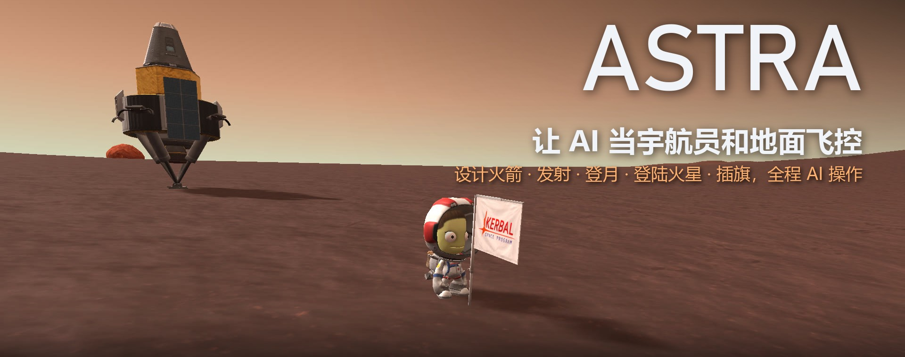
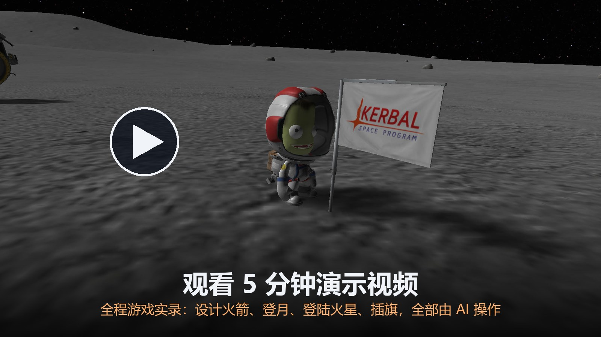
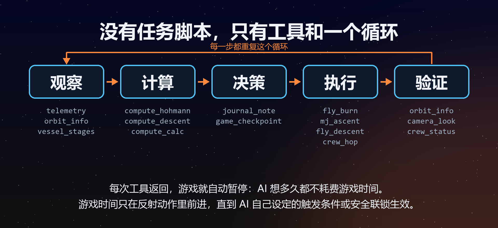

<div align="center">



[English](README.md) | 简体中文

### 给 Claude 一局正在运行的《坎巴拉太空计划》，它会自己把任务飞完。

74 个工具，一个循环（观察、计算、决策、执行、验证）；AI 思考的时候，游戏停下来等它。

[](https://www.kerbalspaceprogram.com/)
[](https://www.python.org/)
[](https://modelcontextprotocol.io/)
[](https://krpc.github.io/krpc/)
[](LICENSE)

[它能做什么](#它能做什么) · [快速开始](#快速开始) · [工作原理](#工作原理) · [飞行记录](#飞行记录) · [失败与教训](#失败与教训) · [工具手册](docs/TOOLS.md)

</div>

ASTRA 把一局正在运行的《坎巴拉太空计划》（KSP 1）变成 74 个 MCP 工具：仪表、计算器、操纵机构和短时反射动作。Claude 用这些工具同时担任宇航员和地面飞控：它读取游戏里实时的零件库，自己设计火箭、发射、规划转移轨道，用 ASTRA 自研的动力着陆反射动作落地，派坎巴拉人出舱插旗，再把 Jebediah 从月球（Mun）飞回家。它的规矩是：每一个数字都从实时遥测里算出来，不凭记忆。

<p align="center">
  <a href="https://github.com/shoal-rat/astra-ksp/releases/tag/v2.0.0">
    
  </a>
  <br>
  <sub>约 5 分钟，1920×1080，中文旁白。画面是游戏内录像和截图，中间穿插标题、示意图和飞行日志卡片；飞行画面里，右上角是 AI 当时正在调用的工具，左下角是那一刻的遥测数据。点击缩略图会打开 <a href="https://github.com/shoal-rat/astra-ksp/releases/tag/v2.0.0">v2.0.0 发布页</a>，<code>astra_showcase.mp4</code> 在那里下载（162 MB）；英文版 <code>astra_showcase_en.mp4</code> 也在同一页。</sub>
</p>

<details>
<summary>视频章节</summary>

| 时间 | 章节 |
|---|---|
| 00:00 | 开场：杜娜上的旗帜 |
| 00:21 | ASTRA 是什么 |
| 00:47 | AI 如何思考 |
| 01:18 | AI 设计火箭 |
| 01:43 | MechJeb 上升入轨 |
| 02:01 | 奔月 |
| 02:13 | 动力着陆 |
| 02:38 | 失败与教训 |
| 02:59 | 出舱插旗 |
| 03:13 | 返航与再入 |
| 03:28 | 登陆杜娜（火星） |
| 04:17 | 一条命令，无人值守 |
| 04:39 | 开源地址 |

</details>

杜娜是 KSP 里的火星。在它的 Midland Sea（6.97 N 39.95 W）立着一面旗，旗上的铭牌是 AI 自己写的：

> *First crewed landing on Duna by ASTRA, an AI flight crew: rocket designed, flown, and landed by
> AI. Valentina Kerman, 2026-09-30*
>
> （AI 飞行机组 ASTRA 完成首次杜娜载人着陆：火箭由 AI 设计、驾驶并着陆。Valentina Kerman，2026-09-30）

这一路没有任务脚本。整个仓库里一个任务脚本都没有，AI 也不许写。

## 数据一览

<table>
<tr>
<td align="center" width="25%"><h3>74</h3>个 MCP 工具，分 9 组</td>
<td align="center" width="25%"><h3>0</h3>仓库里的任务脚本</td>
<td align="center" width="25%"><h3>473</h3>次工具调用，全部记录在公开的飞行日志里</td>
<td align="center" width="25%"><h3>8</h3>份飞行日志，全部公开：5 次成功，3 次中止</td>
</tr>
<tr>
<td align="center"><h3>80.3 × 79.6 km</h3>坎星轨道（远拱点 × 近拱点），火箭由 AI 设计</td>
<td align="center"><h3>0.03 m/s</h3>月球触地时的垂直速度（着陆器 4 号，后来还是翻倒了）</td>
<td align="center"><h3>1.22 m/s</h3>杜娜触地速度，横向 0.01 m/s</td>
<td align="center"><h3>377 天</h3>从发射到杜娜触地（坎星日，每天 6 小时）</td>
</tr>
</table>

## 它能做什么

<table>
<tr>
<td width="50%"></td>
<td width="50%">
<h3>自己设计火箭</h3>
它在实时零件库里搜索（<code>parts_search</code>、<code>part_info</code>），写出零件树。<code>design_check</code> 给出每一级的 Δv 和推重比（TWR），并检查操控能力和电力；<code>design_build</code> 写出 <code>.craft</code> 文件。火箭上了发射台，AI 再拿 <code>vessel_stages</code> 和设计核对。
<br><br>
<sub>轨道器 1 号转不了向。AI 查明原因，围绕一台能摆动喷管（gimbal）的发动机重新设计，又飞了一次。</sub>
</td>
</tr>
<tr>
<td width="50%">
<h3>飞上轨道</h3>
上升段可以交给 MechJeb：每一项设置都由 AI 决定，工具返回时会回显 MechJeb 实际生效的设置，ASTRA 的安全联锁全程盯着爬升。AI 也可以亲自飞：按自己写的俯仰程序，分段调用 <code>fly_until</code> 爬上去，两艘轨道器都是这么飞的。
<br><br>
<sub>轨道器 2 号：80.3 × 79.6 km，e = 0.0005。轨道器 3 号全自动飞行：81.66 × 79.97 km，i = 0.18°。</sub>
</td>
<td width="50%"></td>
</tr>
<tr>
<td width="50%"></td>
<td width="50%">
<h3>用 ASTRA 自己的制导着陆</h3>
<code>fly_descent</code> 是 ASTRA 自研的动力着陆反射动作：它逐步数值积分，预测自杀式点火（suicide burn）；一路盯着前方最高的地面；在离地几米处悬停，直到横向漂移低于 AI 设定的限值，再把着陆器竖直放下，交给 SAS 稳住。
<br><br>
<sub>用这套制导完成的月球触地：0.86 m/s（着陆器 3 号）和 0.03 m/s（着陆器 4 号），均为垂直速度。</sub>
</td>
</tr>
<tr>
<td width="50%">
<h3>飞向另一颗行星</h3>
它选出兰伯特（Lambert）转移窗口，在 KSP 的圆锥曲线拼接（patched conics）上细调机动节点，点火 1,091 m/s 离开坎星。两次中途修正（先 16.5 m/s，再 0.83 m/s）对准进场；713 m/s 的捕获点火烧到一半，AI 事先开启的自动分级甩掉了烧空的转移级。杜娜稀薄的大气把着陆器减速到 411 m/s，此时离地 6 km；三顶降落伞打开，最后由发动机以 1.22 m/s 把它放到地面。
</td>
<td width="50%"></td>
</tr>
<tr>
<td width="50%"></td>
<td width="50%">
<h3>派坎巴拉人出舱</h3>
<code>crew_eva</code> 配合一次喷气背包跳跃，把坎巴拉人带离着陆器；<code>crew_walk</code> 按方位角或坐标行走；<code>crew_plant_flag</code> 插旗，铭牌由 AI 撰写；<code>crew_board</code> 回到舱内。bridge 插件通过一个 Harmony 补丁驱动游戏原版的 EVA 操控。
</td>
</tr>
<tr>
<td width="50%">
<h3>核验每一步，全程留档</h3>
点火会报告实际施加的 Δv，发射会报告实际在船上的是谁，旗子要在游戏里真的存在才算插上。每一次工具调用都写进任务的 <code>log.jsonl</code>；决策写进 <code>journal.md</code>，同时显示在游戏内的 CAPCOM 面板上（F8），你可以直接在面板上回复。
<br><br>
<sub>ASTRA Duna 1 触地后：立得笔直（89.8°），13 个零件一个不少，SAS 已稳住。</sub>
</td>
<td width="50%"></td>
</tr>
</table>

## 快速开始

**你需要**

- Windows
- 坎巴拉太空计划 1.12.5，并装好 **kRPC 0.5.4**、**MechJeb2**、**ModuleManager** 和 **Harmony**（`GameData/000_Harmony`，行走和喷气背包跳跃要用）
- 本仓库的 **KspAutomationBridge** 插件（第 2 步编译，或直接用预编译的 2.1.0 压缩包）
- Python 3.11+
- 已登录的 Claude Code。全自动运行器复用本机的这份登录，不需要 API key。

ASTRA 会先在 Steam 默认目录里找 KSP，再找正在运行的 `KSP_x64.exe`；如果装在别处，请设置 `ASTRA_KSP_DIR`。

**1. 克隆并安装。** 可选扩展有 `agent`（Claude Agent SDK）、`media`（imageio-ffmpeg，录像用）和 `dev`（pytest）。

```bash
git clone https://github.com/shoal-rat/astra-ksp.git
```

```bash
cd astra-ksp
```

```bash
python -m venv .venv
```

```bash
.venv/Scripts/python.exe -m pip install -e ".[agent,media,dev]"
```

**2. 编译并安装 bridge 插件。** 必须先关掉 KSP，因为游戏运行时会以内存映射的方式占用这个 DLL。这一步用 Windows 自带的 .NET Framework 编译器（`csc.exe` v4.0.30319）针对你本机的 KSP 编译插件，把 DLL 复制到 `GameData/KspAutomationBridge/Plugins/`，把 `MechJebForAll.cfg` 复制到 `GameData/KspAutomationBridge/`。也可以从 [v2.0.0 发布页](https://github.com/shoal-rat/astra-ksp/releases/tag/v2.0.0) 下载预编译的 `KspAutomationBridge-2.1.0.zip`（已按 GameData 目录结构打包）。

```bash
.venv/Scripts/astra.exe bridge install
```

**3. 新建一个干净的存档（可选），然后启动游戏。** `newsave` 复制一个现有存档的游戏设置和宇航员名单（`--from` 指定它的文件夹），但不带其中的飞行器。中文版 KSP 自带的存档文件夹可能叫 `默认` 而不是 `default`，这时就写 `--from 默认`。`up` 会在需要时启动 KSP，等 bridge 就绪后加载存档。

```bash
.venv/Scripts/astra.exe newsave astra --from default
```

```bash
.venv/Scripts/astra.exe up --save astra
```

**4. 起飞。** 三种方式任选其一。

- **在 Claude Code 里和机组对话。** 在 `astra-ksp` 文件夹里打开 Claude Code：`.mcp.json` 会启动 `astra` MCP 服务器，`CLAUDE.md` 让这个会话成为飞行机组。直接说出你想做的事，比如“让一个坎巴拉人登上月球，插一面旗，再把他带回家”。你就是飞行总指挥：真正需要拍板的时候，机组会来问你，其余的它自己飞。
- **全自动任务。** 一个 Claude Agent SDK 机组独立完成目标，用的是你本机的 Claude Code 登录：

  ```bash
  .venv/Scripts/astra.exe mission "land on the Mun and return"
  ```

  这个机组手里只有 astra 工具，外加 `booster-engineer` 和 `fido` 两个专家子代理：没有 shell，也不能读写文件，所以它没法写脚本。飞行日志和对话记录保存在 `missions/<timestamp>-<goal>/`。加上 `--record` 就能同时录像。
- **手动调用。** 先启动守护进程，让操纵输入在两次调用之间保持有效，然后逐个调用工具：

  ```bash
  .venv/Scripts/astra.exe serve --http
  ```

  ```bash
  .venv/Scripts/astra.exe call telemetry detail=brief
  ```

`astra tools -v` 会打印每个工具的完整说明；[`docs/TOOLS.md`](docs/TOOLS.md) 是同一份参考的文档版。用的是别的 MCP 客户端？[`AGENTS.md`](AGENTS.md) 演示了如何在 Codex 里注册同一个服务器。

## 工作原理

<p align="center">
  
</p>

### AI 思考时，世界静止

语言模型回答一次要好几秒，大气层里的火箭可不会等它。所以每次工具返回，ASTRA 都会暂停游戏；暂停由 bridge 直接完成，不会弹出 KSP 的 ESC 菜单。暂停期间照样能读遥测、改机动节点、调整操纵。游戏时间只在这些时候流动：反射动作（`fly_*`）运行时、带 `watch` 运行的 MechJeb 工具里，以及行走之类的乘员动作中；分级、存档点或切换飞行器只会让时间走一瞬间。在下面的杜娜日志里，着陆器正处在再入途中、悬在杜娜上空 38 km，两次调用之间现实时间过去了 4 小时 43 分钟。上一个反射动作结束时速度是 942.851 m/s，下一个开始时是 942.852 m/s。

<details>
<summary>到底哪些调用会让游戏时间流动</summary>

<br>

| AI 调用 | 游戏时间走多久 |
|---|---|
| `fly_until`、`fly_burn`、`fly_descent` | 直到 AI 设定的某个触发条件成立或机动完成、安全联锁跳闸，或 AI 设定的时间上限用完 |
| `fly_warp` | 直到 AI 要求的时间或事件；飞行中遇到大气层会提前停下，在无大气天体上空则停在下限高度 |
| 带 `watch: true` 的 `mj_*` 自动驾驶 | 直到 MechJeb 报告自动驾驶空闲、某个 `stop_when` 触发条件成立、安全联锁跳闸，或 `max_game_s` 用完 |
| `crew_eva`、`crew_walk`、`crew_hop`、`crew_plant_flag`、`crew_board`、`crew_transfer` | 直到坎巴拉人站稳、走到或坐进座位（走一段路可能要好几分钟） |
| `control_stage`、`control_part` | 几个物理帧，让分级或分离后的飞行器能真正分开 |
| 带 `wait_aligned_deg` 的 `control_attitude` | 直到指向误差稳定在这个角度以内 |
| `game_switch_vessel`、`game_restore`、`game_checkpoint` | 一瞬间（恢复存档点 1 s，创建存档点 0.2 s） |
| 仪表、计算器、节点编辑和日志：`telemetry`、`orbit_info`、`compute_*`、`node_create`、`journal_note`…… | 完全不走 |

</details>

### 反射动作：什么时候停，由 AI 说了算

凡是变化快过模型思考的事，都交给**反射动作**：一个跑在 kRPC 数据流上、约 20 Hz 的控制回路。它按 AI 下达的控制律运行，直到 AI 设定的某个触发条件成立：可以是数值条件，比如 `surface_altitude <= 6000`，也可以是事件，比如 `flameout` 或 `landed`。随后它暂停游戏，报告为什么停、看到了什么，以及最终状态。

| 反射动作 | 它负责飞什么 |
|---|---|
| `fly_until` | 油门律（保持推重比、“把远拱点推到目标值再渐收油门”）和姿态律（AI 写的俯仰表、带俯仰限幅的地表顺行方向、节点方向），直到某个触发条件成立 |
| `fly_burn` | 一个机动节点：时间加速到节点，转向点火方向，只有按时对准才点火（沿节点的固定方向迟到点火会把轨道烧歪），渐收油门关机，并报告实际施加的 Δv |
| `fly_warp` | 时间加速；宁可提前停下，也不闯进大气层，也不在无大气天体上空跌破 AI 设定的下限高度 |
| `fly_descent` | 动力着陆：数值积分的自杀式点火预测器、前方地形预判、高度优先制动、悬停消除漂移、触地后交给 SAS |

**安全联锁**垫在每个反射动作底下：熄火、零件丢失、引力圈（SOI）切换、过热、撞击风险、失控、电量不足。它们从不替 AI 操作，只负责叫停反射动作、交回控制权。公开的飞行中一共跳闸 5 次，其中 3 次发生在第一次入轨任务里：失控联锁在 7.3 km 叫停了轨道器 1 号的爬升；电量不足联锁在发动机点燃之前叫停了轨道器 2 号的离轨点火；撞击联锁在 999 m 高度叫停了返回舱（`impact: ground in 6.2 s at 162 m/s descent; parachutes: deployed`），而 1,000 m 正是它的 Mk16 降落伞完全张开的高度。AI 用 `"impact": null` 重新下达这一段，返回舱以 3.9 m/s 溅落。另外两次是月球着陆器 3 号在 MechJeb 上升段的过热停止（某个零件先达到最高温度的 95%，后来又到 99%）。

**分级始终由 AI 决定。** 只有 AI 开启了 `auto_stage`，反射动作才会自行分级，而且只限两种情况：下一级会点燃发动机，同时丢掉的推进剂不超过 50 kg；或者只丢掉空零件，而另一台发动机还在工作。在杜娜，转移级在捕获点火进行到 108.1 s 时烧干，反射动作执行分级，着陆器的发动机接着完成了剩下的点火。

<details>
<summary>安全联锁的默认值</summary>

<br>

在预计会出现某种情况的那一段，AI 可以放宽其中任意一项（设为 `false` 或 `null` 即关闭）：

```json
{"flameout": true, "part_lost": true, "soi_change": true, "overheat": 0.95,
 "impact": {"seconds": 10, "speed_mps": 12},
 "loss_of_control": {"error_deg": 25, "seconds": 4, "min_q_pa": 3000},
 "low_power": 0.02, "dry_debounce_s": 0.4}
```

</details>

<details>
<summary><code>fly_descent</code> 是怎么着陆的</summary>

<br>

- **制动。** 自杀式点火预测器对一次地表逆行点火做数值积分：推力取 (1 − reserve) × 最大推力，重力扣除水平速度带来的离心减重。只要预测的停止点还在门限之上，发动机就保持关闭；之后以仍能守住门限的最低油门点火。
- **前方地形。** 门限设在前方航迹上采样到的最高地面之上 `terminal_alt_m` 处；采样一直延伸到预测停止点之外，途经的高峰在越过之前都会被记住。
- **高度优先制动。** 如果全推力逆行也守不住门限，就让推力的垂直分量维持一个仍刹得住的下沉速度，其余推力用来消除水平速度。
- **末段。** 下沉速度与离地高度成正比，同时逆着漂移方向倾斜。离地几米时悬停，直到漂移低于 `touchdown_drift_mps`，再竖直落地。
- **触地之后。** 关闭发动机，反射动作再运行 4 秒游戏时间，然后让自动驾驶保持关闭，由 SAS 稳住落定后的姿态。
- 没有建模大气阻力：阻力只会帮忙。离线闭环模拟器（[`tests/descent_sim.py`](tests/descent_sim.py)）不开游戏就能检验这套制导。

</details>

### 只给能力，不给任务

每个工具都是仪表、计算器、操纵机构或短时反射动作。没有一个工具会替 AI 飞任务，任何参数的默认值也不允许暗含任务决策。目标高度、点火时长、俯仰程序、分级、着陆点和余量，都是 AI 每次用 `compute_*` 工具现算出来的参数，这些工具的结果会把计算过程一并列出。以 `fly_descent` 为例，AI 必须自己给出 `touchdown_mps`、`terminal_alt_m`、`throttle_reserve` 和 `touchdown_drift_mps`，工具说明会讲清楚怎样根据着陆腿、支撑跨度和坡度推导它们。这里也没有作弊：上一代设计里的 `/vessel/refuel` 和 `/spawn-crew` 两个 bridge 接口已经删掉了。

### 底层结构

```text
Claude ── Claude Code 会话，或 `astra mission`（Claude Agent SDK）
  │
  │  MCP · 74 个工具 · 每次工具返回，游戏即暂停
  ▼
astra (Python) ── 工具 · 反射引擎（~20 Hz）· 物理计算 · craft 文件生成 · 飞行日志 · 录像
  │
  ├─ kRPC 0.5.4 ─────────────────── 遥测、操纵、机动节点、时间加速
  ├─ KspAutomationBridge 2.1.0 ──── HTTP 127.0.0.1:48500：零件数据库、EVA、MechJeb、暂停、CAPCOM、录像
  ▼
坎巴拉太空计划 1.12.5，加装 MechJeb2、ModuleManager 和 Harmony
```

机组的规矩（不写脚本；数字靠算，不靠记；任何不可逆操作之前先存一个有名字的存档点；只报告遥测显示的事实）写在 [`knowledge/doctrine.md`](knowledge/doctrine.md) 里；另有 11 本 playbook 教它怎样推导数字，但从不告诉它该填哪个数。

<details>
<summary>全部 74 个工具，按组列出</summary>

<br>

| 分组 | 数量 | 工具 |
|---|---:|---|
| **observe**：仪表 | 7 | `telemetry` `vessel_parts` `body_info` `orbit_info` `target_info` `camera_look` `vessel_stages` |
| **compute**：计算尺 | 10 | `compute_calc` `compute_orbit` `compute_hohmann` `compute_rocket` `compute_descent` `compute_ascent_estimate` `compute_maneuver` `compute_node_search` `compute_transfer_window` `compute_terrain` |
| **design**：设计台 | 6 | `parts_search` `part_info` `design_check` `design_build` `design_from_craft` `craft_list` |
| **game**：游戏导演 | 12 | `game_status` `game_load_save` `game_checkpoint` `game_restore` `game_revert` `game_launch` `game_list_vessels` `game_switch_vessel` `game_recover` `game_space_center` `game_pause` `game_log` |
| **control**：直接操纵 | 9 | `control_set` `control_stage` `control_attitude` `control_part` `control_action_group` `node_create` `node_list` `node_delete` `target_set` |
| **fly**：反射动作 | 4 | `fly_until` `fly_burn` `fly_warp` `fly_descent` |
| **autopilot**：MechJeb | 9 | `mj_ascent` `mj_execute_node` `mj_land` `mj_rendezvous` `mj_dock` `mj_plan` `mj_status` `mj_abort` `mj_stage_stats` |
| **crew**：坎巴拉人 | 8 | `crew_roster` `crew_eva` `crew_hop` `crew_status` `crew_walk` `crew_plant_flag` `crew_board` `crew_transfer` |
| **journal**：日志、教训、条令 | 9 | `mission_start` `mission_end` `journal_note` `journal_read_doctrine` `playbook` `lessons_search` `lesson_add` `capcom_say` `capcom_inbox` |

公开的飞行日志里调用过其中 52 个。交会和对接工具已经就位，但还没有飞过任何一次交会或对接。每个参数的说明见 [`docs/TOOLS.md`](docs/TOOLS.md)，或运行 `astra tools -v`。

</details>

## 逐条回放：登陆杜娜

下面是杜娜飞行的 [`log.jsonl`](docs/missions/20260930-080619-land-valentina-on-duna-and-plant-a-flag-/log.jsonl) 里连续的 20 次调用，即第 [36] 到 [55] 条记录（从 0 开始编号）：从 63 × 52 km 的轨道开始，到 Valentina 回到座位上为止。参数和结果只保留关键字段，较长的数值做了四舍五入；引号里的文字是日志原文。

```text
── 观察 ────────────────────────────────────────────────────────────────────────────
[36] orbit_info       of="vessel"
     ↳ 杜娜 · 远拱点 63,407 m · 近拱点 52,142 m
[37] vessel_stages
     ↳ 6.79 t · 第 1 级：LV-909 (liquidEngine3.v2)，真空 Δv 2,974 m/s

── 先计算，再决策 ──────────────────────────────────────────────────────────────────
[38] compute_maneuver kind="deorbit_to_periapsis" at="ut" target_alt_m=12000
     ↳ 顺行 -25.92 m/s · 点火 2.92 s
[39] node_create      prograde_mps=-25.9231
     ↳ 节点之后的轨道：近拱点 12,000 m · 远拱点 63,224 m
[40] game_checkpoint  name="duna1_orbit_low"
[41] journal_note     plan: "deorbit 25.9 m/s at 90 E to a 12 km periapsis; aerobrake retrograde
                      through the thin air; chutes (Mk16 + 2 Mk2-R) once below ~260 m/s; ..."

── 执行：离轨点火 ──────────────────────────────────────────────────────────────────
[42] fly_burn         max_throttle=0.3 align_deg=3.0 max_late_s=5.0 tolerance_mps=0.05
     ↳ "aligned at burn start (error 0.09 deg, 0.0 s late)"
     ↳ 节点 25.92 m/s，实际施加 25.91 m/s · orbiting -> sub_orbital

── 执行：再入 ──────────────────────────────────────────────────────────────────────
[43] fly_until        until: surface_speed <= 260  或  surface_altitude <= 6000
                      throttle=0 · attitude=surface retrograde · max_real_s=600
     ↳ 超时："max_real_s 600 reached (game time ran 599.6 s)"
     ↳ sub_orbital -> flying · 38,033 m · 942.851 m/s

   · · ·  下一次调用之前，现实时间过去了 4 小时 43 分钟；游戏一直暂停着，等它  · · ·

[44] fly_until        触发条件和控制律同上 · max_real_s=2400
     ↳ 触发："surface_altitude <= 6000 (now 5988.63)"，游戏时间过了 321.68 s · 411.1 m/s

── 决策：先开伞，再动力下降 ────────────────────────────────────────────────────────
[45] journal_note     decision: "Entry brought the lander to 6.0 km above ground at 411 m/s
                      ... deploy the chutes (Mk16 + 2 Mk2-R) now and hand over at once to
                      fly_descent ..."
[46] control_stage
     ↳ parachuteSingle、parachuteRadial、parachuteRadial · 前后都是 13 个零件
[47] fly_descent      touchdown_mps=1.5 terminal_alt_m=150 throttle_reserve=0.2
                      touchdown_drift_mps=0.5 terminal_rate=0.15 max_tilt_deg=30
                      tilt_gain_deg_per_mps=10 sink_gain=0.8 legs_alt_m=3000 max_game_s=600
     ↳ 触地：垂直 -1.22 m/s，水平 0.014 m/s · flying -> landed
     ↳ "autopilot off at touchdown; SAS holding the settled attitude after 4 s"

── 验证并存档 ──────────────────────────────────────────────────────────────────────
[48] journal_note     result: "Touchdown on Duna, Midland Sea, 6.97 N 39.95 W: vertical
                      1.22 m/s, horizontal 0.01 m/s, upright (89.8 deg), all 13 parts ..."
     ↳ UT 1997275529 · MET 377d 04:04:41
[49] game_checkpoint  name="duna1_landed"

── 出舱：跳出、插旗、回舱 ──────────────────────────────────────────────────────────
[50] crew_eva         kerbal="Valentina" hop_clear_m=6.0
     ↳ 已验证 · 喷气跳跃在离瞄准点 0.59 m 处松开
[51] crew_walk        bearing_deg=316.7 distance_m=6.0       ↳ 到达 · can_plant_flag true
[52] crew_plant_flag  name="ASTRA Duna Base" plaque="..."    ↳ 已插下 · 杜娜，Midland Sea
[53] crew_walk        lat_deg=6.9682 lon_deg=-39.9487        ↳ 到达 · 离舱口 3.86 m
[54] crew_status      kerbal="Valentina"                     ↳ Idle (Grounded)，够得着舱口
[55] crew_board       part="nearest"                         ↳ 已登上 "ASTRA Duna 1"
```

**怎么读这段日志**

- **循环按顺序走。** 调用 [36] 到 [41] 依次观察、计算、放置节点、检查节点预测的轨道、存档、写下计划，全都在任何反射动作运行之前完成。
- **反射动作何时停，由 AI 决定。** 再入段在 260 m/s **或**离地 6 km 时停下，先到者为准。结果是 6 km 那一条先触发，当时速度 411 m/s。
- **时间上限是暂停，不是失败。** 调用 [43] 在 38 km 高度碰到了自己设定的现实时间上限，交回控制权；AI 用更长的上限重新下达，[44] 从 [43] 停下的地方接着飞。
- **每个制导数字都是参数。** 调用 [47] 列出了这次着陆的全部参数，每一个都由 AI 选定。调用 [49] 在任何人打开舱门之前先存了档。

任务以 `mission_end` 收尾：`"outcome": "success"`，`"tool_errors": 0`。

<p align="center">
  
  <br>
  <sub>调用 [52] 的结果：Valentina Kerman 和旗帜“ASTRA Duna Base”，在杜娜的 Midland Sea，距离发射 377 个坎星日（每天 6 小时）。</sub>
</p>

## 飞行记录

下面每一次飞行都是通过这些工具飞出来的。[`docs/missions/`](docs/missions/) 里的每个文件夹都有机组边飞边写的 `journal.md`，以及一份 `log.jsonl`，记录每一次工具调用及其参数和结果（超过 6,000 字符的结果会被截断）。全自动的那一次还保留了完整的对话记录（transcript）。

| 飞行 | 经过 | 调用次数 | 结果 |
|---|---|---:|---|
| **[轨道器 2 号](docs/missions/20260929-233547-design-a-crewed-rocket-from-the-live-par/)**<br><sub>Jebediah · 设计、入轨、返回</sub> | 轨道器 1 号在 7.3 km 失控（助推级上没有一台发动机能摆动喷管）；AI 恢复发射台存档点，换上 Swivel 重建。入轨 80.3 × 79.6 km；返回舱没电之后，只靠发动机喷管摆动转向完成离轨，最后以 3.9 m/s 溅落。 | 68 | 成功 |
| **[轨道器 3 号](docs/missions/20260930-000855-design-a-crewed-rocket-from-the-live-par/)**<br><sub>Valentina · 同一目标，全自动（`astra mission`）</sub> | 由一个只有 ASTRA 工具的 Claude Agent SDK 机组全自动飞完。它加装了电池和太阳能板，亲自飞完爬升，进入 81.66 × 79.97 km 轨道，再靠降落伞把 Valentina 带回家。第一个会话在 37 轮后中断，随后接着续飞。 | 64 | 成功 |
| **[月球着陆器 1 号](docs/missions/20260930-025706-crewed-mun-landing-and-return-land-jebed/)**<br><sub>Jebediah · 登月并返回</sub> | MechJeb 负责上升和奔月射入。第 1 次下降悬停在 13 km，第 2 次遇上前方隆起的地形，第 3 次以 1.5 m/s 着陆。插下旗帜“ASTRA Mun Base 1”。窄底着陆器在 5.7° 的坡上翻倒两次，都从存档点恢复；最后以 4.4 m/s 溅落。 | 101 | 成功 |
| **[月球着陆器 2 号](docs/missions/20260930-041640-showcase-crewed-mun-landing-and-return-w/)**<br><sub>四条腿，窄底</sub> | 用旧的恒定减速制导在 Farside Crater 以 1.4 m/s 着陆，随后翻倒：坡度 4°，还带着 2.1 m/s 的横向漂移。 | 44 | 中止 |
| **[月球着陆器 3 号](docs/missions/20260930-052437-showcase-crewed-mun-landing-and-return-w/)**<br><sub>2.5 m 宽底</sub> | 旧制导让它以 118 m/s 坠毁。换上新的自杀式点火预测器后，它以 0.86 m/s 着陆，横向 0.05 m/s，稳稳立住。Jebediah 出舱后站到了燃料箱的边沿上，从那里走下来时两次把着陆器弄翻。 | 66 | 中止 |
| **[月球着陆器 4 号](docs/missions/20260930-061439-showcase-crewed-mun-landing-and-return-w/)**<br><sub>窄底，六条腿</sub> | 以 0.03 m/s 触地。第一次喷气背包跳跃让 Jebediah 离开时完全没碰到着陆器，它还是翻了：驾驶员一出舱，就没有 SAS 了。 | 43 | 中止 |
| **[月球着陆器 3 号（续）](docs/missions/20260930-074333-showcase-continued-lander-3-surface-oper/)**<br><sub>Jebediah · 插旗并返回</sub> | 从着陆后的存档点继续：喷气背包跳跃出舱，插下旗帜“ASTRA Mun Base”。驾驶员一离开，着陆器就翻了；因此正如机组日志所记，返程是从出舱前的存档点飞起的，那时着陆器还立着，而这次恢复也把那面旗一并回退了。最后靠降落伞落回坎星。 | 30 | 成功 |
| **[杜娜 1 号](docs/missions/20260930-080619-land-valentina-on-duna-and-plant-a-flag-/)**<br><sub>Valentina · 单程</sub> | 兰伯特窗口，1,091 m/s 逃逸点火，两次中途修正，713 m/s 捕获进入 63 × 52 km 轨道。气动减速、三顶降落伞、1.22 m/s 动力触地。一个探测器核心让 SAS 在出舱、插旗“ASTRA Duna Base”和回舱全程保持开启。单程任务：没有能飞出杜娜引力井的上升器。 | 57 | 成功 |
| **合计** | 8 份飞行日志 | **473** | 5 次成功，3 次中止 |

<sub>一次调用就是任务 <code>log.jsonl</code> 里的一行，失败的调用也算在内（八次飞行共 13 次）。<code>mission_start</code> 之前的调用记在单独的 <code>_unassigned</code> 日志里，不算进任务。三次中止都是主动结束的，为的是换用另一台着陆器。</sub>

## 失败与教训

八次飞行里有三次中止，日志把每一次失败的尝试都和成功的放在一起，原样保留。每个问题最后都变成了 [`knowledge/lessons.md`](knowledge/lessons.md) 里的一条教训、[CHANGELOG](CHANGELOG.md) 里的一项修复，或者两者都有。

- **转不了向的火箭。** 轨道器 1 号的俯仰程序在 7.3 km 要求 57°，火箭却还保持着 84° 的仰角：LV-T30 Reliant 和 RT-10 Hammer 的喷管都不能摆动。AI 恢复发射台存档点，把芯级换成能摆动喷管的 LV-T45 Swivel 重建。现在 `design_check` 会检查操控能力。
- **电耗光的返回舱。** 轨道器 2 号在 23 分钟的滑行中一直保持姿态，耗光了全部 65 单位 ElectricCharge。AI 改用 `fly_until` 完成离轨，只靠 Terrier 的喷管摆动转向。现在 `design_check` 会检查电力，下一艘轨道器也带上了电池和太阳能板。
- **悬停在 13 km。** 月球着陆器 1 号的第一次下降在 13 km 高度悬停，把 600 s 全部耗完：kRPC 的 `Vessel.bounding_box` 返回了 ±6×10¹⁷ m，因为原版 Mk1 指令舱报告的包围盒是坏的。现在飞行器的包围盒由各零件正常的包围盒拼成（`telemetry.vessel_box`）。
- **前方的地形。** 以 570 m/s 进场，要刹大约 15 km 才停得住；这段路径下面有一道 450 m 的隆起，按平地规划的制动剖面在满油门制动时还是撞了上去。现在 `fly_descent` 会沿航迹采样最高的地面，一直采到预测停止点之外；下一次下降以 1.5 m/s 着陆。
- **118 m/s 的坠毁。** 恒定减速模型让推重比 5.4 的着陆器 3 号以 118.6 m/s 的横向速度撞上月面。现在制动改用数值积分的自杀式点火预测器，配合高度优先制动，并由离线闭环模拟器（[`tests/descent_sim.py`](tests/descent_sim.py)）和一次对抗式评审留下的回归用例覆盖。同一台着陆器随后以 0.86 m/s 触地。
- **翻倒的着陆器。** 四台月球着陆器都在触地后翻倒过：一次在 5.7° 的坡上，一次带着 2.1 m/s 的漂移，一次是 Jebediah 从燃料箱边沿走下来，还有一次发生在一次根本没碰到着陆器的喷气背包跳跃之后。每一次翻倒都恰好伴随着当前飞行器的切换或一次重新加载，而驾驶员出舱后就没有 SAS。已在杜娜验证过的解决办法：宽底着陆器配一个开着 SAS 的探测器核心，触地前消除漂移，出舱时直接从舱口跳出去。杜娜着陆器在出舱、插旗和回舱全程都保持在偏离竖直 0.6° 以内（89.4°）。
- **恢复存档后冒出一颗小行星。** 一个刚登舱就存下的存档点，恢复出来时当前飞行器竟然是一颗小行星：KSP 在飞行器切换完成之前就存了档。现在存档和恢复都会在飞行器切换前后先让物理稳定下来。
- **工具看不见的坎巴拉人。** kRPC 的飞行器列表不包含出舱的坎巴拉人和旗帜，所以现在所有出舱和插旗检查都改走 bridge。行走控制器现在也会转动坎巴拉人的朝向。
- **在杜娜太弱的喷气背包。** 最新的一条教训是：“The stock EVA pack gives about 0.94 g on Duna (2.76 of 2.92 m/s^2): it cannot take off from the ground”（原版 EVA 喷气背包在杜娜只能提供约 0.94 g，从地面起飞不了）。所以在杜娜，跳跃改为从舱口滑翔出去。

教训会在飞行之间传承。`mission_start` 会把与目标相关的教训交给机组；杜娜这次返回了八条，第一条来自上一代设计的一次飞行：*“A tall, narrow single-stack lander tipped over on Duna, burying the hatch…”*（又高又窄的单列着陆器在杜娜翻倒，把舱门埋住了……）。这次的杜娜着陆器是宽底的，还带了探测器核心。全自动机组在最终报告里解释了自己为什么这样设计轨道器 3 号（[对话记录](docs/missions/20260930-000855-design-a-crewed-rocket-from-the-live-par/transcript-20260930-020636.jsonl)）：

> I added the power because an earlier flight's capsule ran flat during a long coast.
>
> （我加装了电源，因为之前一次飞行的返回舱在长时间滑行中把电耗光了。）

`knowledge/lessons.md` 现在收录了 206 条单行教训：178 条整理自上一代项目 2026 年 6 月的飞行，28 条写于 2026 年 9 月 29 日和 30 日的实飞。

## 用 `astra record` 录像

bridge 在屏幕外渲染游戏摄像机的画面，异步读回每一帧（`AsyncGPUReadback`，每帧只占主线程约 2–3 ms），再通过管道交给 ffmpeg 编码成 H.264。游戏暂停时它不录帧，所以 AI 的思考过程永远不会出现在画面里。镜头导演会为每个阶段取景（绕着飞行器缓慢环绕、给坎巴拉人特写、着陆时贴近地面），它只移动镜头，从不碰飞行操纵。

每次录制都保存在 `recordings/<timestamp>/`：`video.mkv`、`frames.csv`（每一帧的 UT 和飞行器状态）和 `marks.csv`（除只读仪表外，每次工具调用的开始和结束）。演示视频（1920×1080，30 fps）就是 [`scripts/showcase/make_video.py`](scripts/showcase/make_video.py) 用这些文件剪出来的，HUD 和 `AI ▶ tool(...)` 字幕也由它生成。录像需要 ffmpeg：`media` 扩展会安装 `imageio-ffmpeg`，也可以用 PATH 上已有的 ffmpeg。

```bash
.venv/Scripts/astra.exe record --dir recordings/my-flight
```

```bash
.venv/Scripts/astra.exe mission "land on the Mun and return" --record
```

<details>
<summary>录像选项</summary>

<br>

| 选项 | 默认值 | 含义 |
|---|---|---|
| `--dir` | `recordings/<timestamp>` | 输出文件夹：`video.mkv`、`frames.csv`、`marks.csv` |
| `--fps` | 15 | 每秒（现实时间）录制的帧数 |
| `--width` / `--height` | 1728 / 按屏幕宽高比 | 画面尺寸 |
| `--crf` | 20 | H.264 画质（越低越好） |
| `--jpeg` | 关 | 输出 JPEG 帧而不是视频，每帧占 KSP 主线程约 20–40 ms（没有 ffmpeg 时也会退回这种模式） |
| `--no-ui` | 关 | 不录游戏界面 |
| `--no-director` | 关 | 不移动镜头 |
| `--stop` / `--status` | | 停止正在进行的录制（可在另一个终端执行）/ 查看录像器状态 |

可用磁盘空间低于 3 GB、ffmpeg 退出或 KSP 关闭时，录像器会自动停止。只要文件 `.cache/director.hold` 存在，镜头导演就不碰镜头。

</details>

## 仓库结构

<details>
<summary>各部分在哪里</summary>

<br>

| 路径 | 内容 |
|---|---|
| `src/astra/registry.py`、`server.py`、`cli.py` | 工具注册表、MCP 服务器（stdio 或 HTTP 守护进程）、命令行 |
| `src/astra/ksp.py`、`bridge.py`、`telemetry.py` | 与游戏的实时连接：一条 kRPC 连接、bridge 客户端、基于数据流的仪表 |
| `src/astra/reflex/` | 反射引擎：控制律、触发条件、事件与安全联锁、点火执行器、时间加速、动力下降 |
| `src/astra/physics/` | 纯轨道力学、火箭计算、兰伯特求解器、安全计算器 |
| `src/astra/craft/` | ConfigNode 解析器、零件目录（实时 prefab 数据）、craft 规格、分级、分级模拟器、`.craft` 生成器 |
| `src/astra/tools/` | 所有工具，每组一个模块 |
| `src/astra/agent/` | 全自动机组运行器（Claude Agent SDK） |
| `src/astra/media.py` | 录像控制、工具调用打点、镜头导演 |
| `knowledge/` | `doctrine.md`（机组的工作方式）、`playbooks/`（10 本物理 playbook，每个阶段一本，外加一份工具速查表）、`lessons.md`（飞行教训） |
| `.claude/agents/` | `booster-engineer` 和 `fido` 两个专家子代理 |
| `csharp/KspAutomationBridge/` | 补上 kRPC 所缺能力的 KSP 插件：带几何信息的零件数据库、EVA（行走、喷气背包跳跃、插旗、登舱）、MechJeb、场景控制、CAPCOM 面板、截图、视频录制 |
| `docs/` | `ARCHITECTURE.md`、`BRIDGE_API.md`、`TOOLS.md`（自动生成）、`missions/`（飞行日志）、`media/` |
| `scripts/showcase/` | 演示视频的分镜脚本和生成器 |
| `tests/` | 离线测试，包括一个闭环着陆模拟器 |

</details>

## 开发

```bash
.venv/Scripts/python.exe -m pytest -q tests csharp/KspAutomationBridge/Tests
```

测试全部离线运行：从不启动、加载、保存、时间加速或改动游戏。添加工具之前，请先读 [`docs/ARCHITECTURE.md`](docs/ARCHITECTURE.md)，它是具有约束力的契约。简而言之：工具是用 `@tool("<group>")` 注册的同步函数，每个参数都带有写给 AI 看的说明，结果使用 SI 单位、键名带单位后缀，预期内的失败抛出 `AstraError(message, hint)`，任何参数默认值都不能暗含任务决策。这里容不下任务脚本、固定的上升或着陆程序，也容不下加燃料、凭空刷出乘员之类的作弊。[`docs/TOOLS.md`](docs/TOOLS.md) 由 `astra tools --markdown` 生成，[`docs/BRIDGE_API.md`](docs/BRIDGE_API.md) 记录了每一个 bridge 接口。

## 致谢

ASTRA 站在这些项目的肩膀上：

- [**坎巴拉太空计划 1.12.5**](https://www.kerbalspaceprogram.com/)：ASTRA 驾驶的游戏本身。
- [**kRPC 0.5.4**](https://krpc.github.io/krpc/)：遥测、操纵、机动节点和时间加速。
- **MechJeb2**：`mj_*` 工具背后的上升、节点执行、着陆、交会、对接和规划自动驾驶。
- **ModuleManager**：应用 `MechJebForAll.cfg`，给每个指令部件装上 MechJeb 核心。
- **Harmony**：让 bridge 能给原版 EVA 操作打补丁，实现坎巴拉人行走和喷气背包跳跃。
- [**Model Context Protocol**](https://modelcontextprotocol.io/) Python SDK、pydantic 和 Pillow；机组用的 **Claude Code** 和 **Claude Agent SDK**；录像用的 **imageio-ffmpeg**；演示视频旁白用的 **edge-tts**。
- **Claude**：[`docs/missions/`](docs/missions/) 里的每一次任务都是它飞的。

## 许可证

MIT。Copyright (c) 2026 Weike Zhang。见 [LICENSE](LICENSE)。
